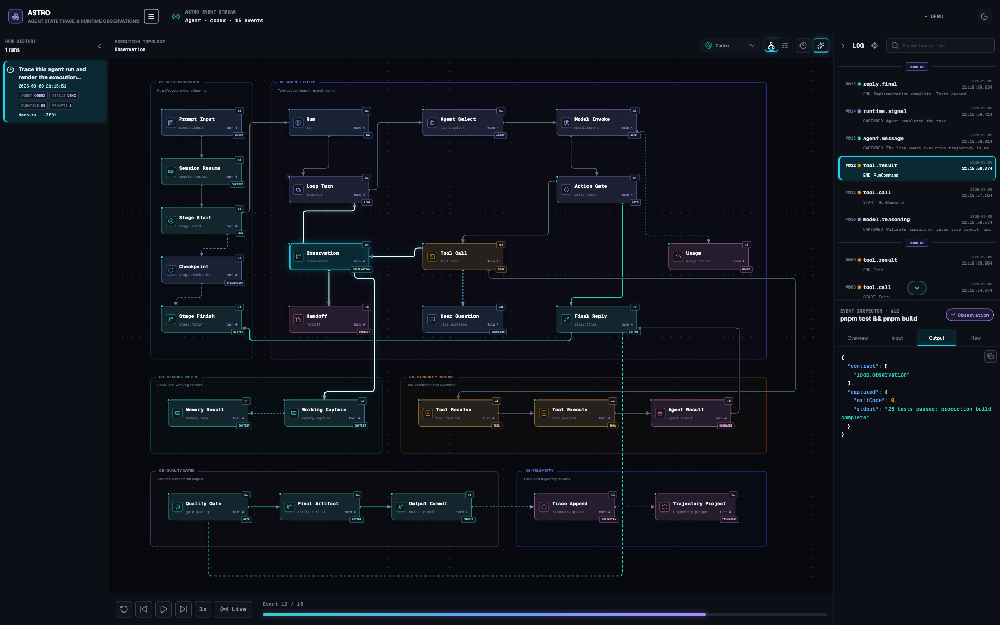
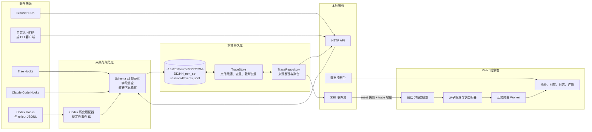
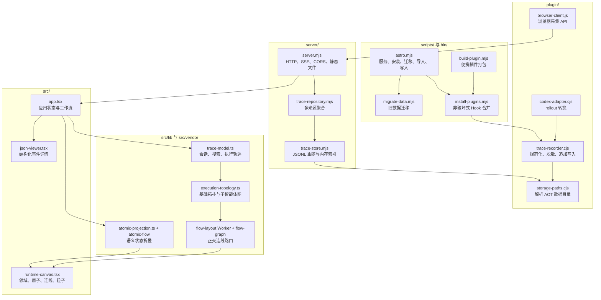
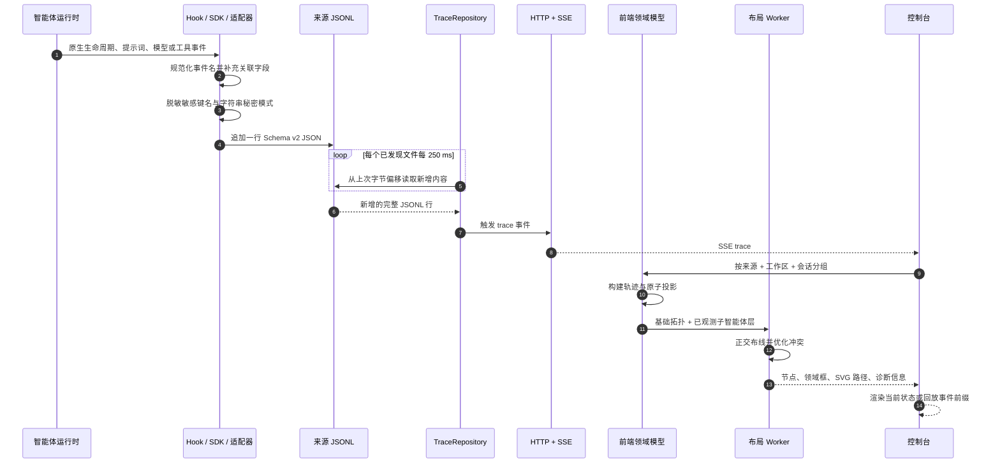
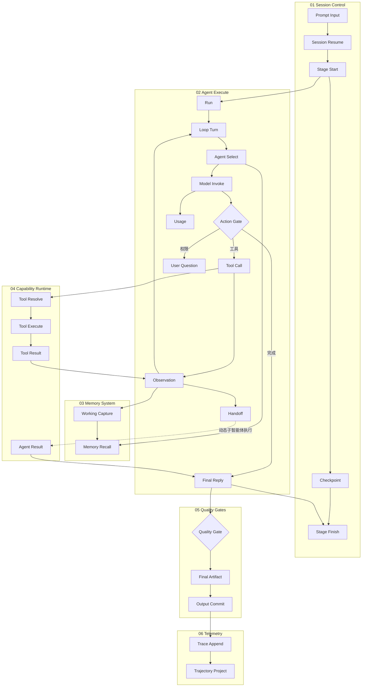

# ASTRO

[English](README.md) | 简体中文

**ASTRO** 是 **Agent State Trace & Runtime Observations** 的缩写，中文可理解为
“智能体状态追踪与运行时观测”。它是编码智能体可观测系统，与 Astro Web 框架无关。

一个面向编码智能体的本地优先运行时可观测、搜索与回放控制台。
ASTRO 将 Trae、Claude Code、Codex、DeepSeek Harness、WorkBuddy / CodeBuddy Code、
浏览器扩展和自定义客户端接入统一的版本化事件协议，无需将追踪数据发送到本机之外。



图中为完整展开的桌面工作区：左侧 `RUNS` 按 Session 和 Prompt 子运行组织历史，
中央画布展示执行拓扑及原子状态，右侧 `EVENTS` 同时提供事件流与详情检查器，
底部控制条用于逐事件定位和历史回放。选中任一事件后，可以继续检查 Overview、
Input、Output 与规范化 Raw JSON；拓扑节点、事件日志和回放游标保持双向联动。

## 目录

- [为什么需要 ASTRO](#为什么需要-astro)
- [主要能力](#主要能力)
- [支持的数据来源](#支持的数据来源)
- [快速开始](#快速开始)
- [系统架构](#系统架构)
- [统一事件协议](#统一事件协议)
- [执行拓扑](#执行拓扑)
- [存储与迁移](#存储与迁移)
- [接入方式](#接入方式)
- [控制台工作流](#控制台工作流)
- [配置](#配置)
- [项目结构](#项目结构)
- [安全与隐私](#安全与隐私)
- [性能与当前边界](#性能与当前边界)
- [开发与验证](#开发与验证)
- [问题排查](#问题排查)
- [文档](#文档)
- [参与贡献](#参与贡献)
- [许可证](#许可证)

## 为什么需要 ASTRO

不同编码智能体运行时使用不同的 Hook 名称、会话标识、事件载荷和持久化格式。
因此，开发者很难跨平台对比运行过程、从工具请求跟踪到执行结果、检查子智能体，
或回放失败发生前的准确状态。

ASTRO 提供一个统一的本地观测层：

- **一次采集：** 将原生 Hook、历史 rollout、Browser SDK 调用和 HTTP 写入规范化为
  相同的事件封装。
- **保留事实：** 规范化后的原始 Trace 事件是事实来源，拓扑原子是独立且可重建的
  语义投影。
- **实时观察：** 本地服务跟随追加写入的 JSONL 文件，并通过服务器发送事件（SSE）
  将增量推送到浏览器。
- **确定性回放：** 每个回放位置都从事件前缀重新构建轨迹、原子状态、稳定连线和
  详情面板。
- **默认本地：** 所有支持的 Hook 都将事件写入用户级 `~/.astrox`。服务除非
  显式修改配置，否则只监听本机回环地址。

ASTRO 只观察智能体执行，不负责调用模型、调度工具、批准权限或改变
智能体决策。

## 主要能力

- 在所有受支持客户端之间使用统一的 `schemaVersion: 2` 事件封装。
- 会话标识同时包含来源与工作区，避免不同客户端的原生 ID 冲突。
- 通过 SSE 实时更新会话；每次初连和重连先恢复完整快照，再接收增量。
- `Stop` 后继续记录同一会话的后续问答，包括内容完全相同的重复输入与回答。
- 每个会话支持可展开的 Prompt 子运行层级；首轮标记为 `INITIAL`，后续轮次按
  `FOLLOW-UP` 编号，每个子项隔离本轮 Prompt 到下一条 Prompt 之前的全部事件。
- active 会话时长每秒更新；默认最多增加到 24 小时，到达阈值后显示为
  `terminated` 并停止计时。
- 历史回放支持重新开始、上一个、播放/暂停、下一个、拖动定位，以及
  `0.5x`、`1x`、`2x`、`4x` 播放速度。
- 提供两个互补视图：
  - **Execution Topology：**展示运行时语义结构。
  - **Run Trajectory：**展示按时间排序的真实步骤与轮次。
- 基础拓扑包含 6 个领域、27 个稳定原子和 28 条定义连线。
- 根据 `SubagentStart` 和 `SubagentStop` 动态生成 `Subagent Execute` 层。
- 基于 Web Worker 的正交连线路由，支持避障、交叉惩罚、诊断和主线程降级。
- 支持原子转换动画、相邻连线高亮和点击定位。
- 详情面板完整展示概览、输入、输出和规范化原始 JSON。
- 全局 History 搜索覆盖 ID、定位符、提示词、消息、工具输入/输出和嵌套 payload
  字段，并支持时间、Agent、状态与事件类型组合筛选。
- 选择一条结果即可联动定位 Session、Prompt 子运行、事件日志、检查器和拓扑原子。
- 使用 `source`、`session` 和 `event` 查询参数生成深链接。
- 支持 JSON/JSONL 导入、按 Prompt 子运行导出 JSONL 和清空本地事件。
- Codex 历史导入使用确定性 ID，重复导入未变化文件不会产生副本。
- 在持久化前递归脱敏敏感信息。
- 支持浅色、深色和系统主题，不依赖 CDN 或远程字体。
- History、Events、主题和平台偏好使用 `ASTROX_*` 本地键持久化。
- Demo 仅用于 development/test；production 空数据保持真实空状态。

## 支持的数据来源

| 来源 | 实时采集 | 历史导入 | 默认数据文件 | 接入方式 |
| --- | --- | --- | --- | --- |
| Trae | 支持 | UI 导入 JSON/JSONL | `~/.astrox/trae/YYYY/MM-DD/HH_mm_ss-<sessionId>/events.jsonl` | 项目 Hook |
| Claude Code | 支持 | UI 导入 JSON/JSONL | `~/.astrox/claude/YYYY/MM-DD/HH_mm_ss-<sessionId>/events.jsonl` | 原生插件或直接 Hook |
| Codex | 支持 | 活跃与归档 rollout JSONL | `~/.astrox/codex/YYYY/MM-DD/HH_mm_ss-<sessionId>/events.jsonl` | 原生插件、直接 Hook 与适配器 |
| DeepSeek Harness | 支持 | UI 导入 JSON/JSONL | `~/.astrox/deepseek/YYYY/MM-DD/HH_mm_ss-<sessionId>/events.jsonl` | 原生 `dsh` bundle |
| WorkBuddy / CodeBuddy Code | 支持 | UI 导入 JSON/JSONL | `~/.astrox/workbuddy/YYYY/MM-DD/HH_mm_ss-<sessionId>/events.jsonl` | 原生插件或直接 Hook |
| 浏览器 / 扩展 | 支持 | UI 导入 JSON/JSONL | `~/.astrox/browser/YYYY/MM-DD/HH_mm_ss-<sessionId>/events.jsonl` | 无依赖 ES Module |
| 自定义客户端 | 支持 | CLI 或 UI 导入 JSON/JSONL | `~/.astrox/<source>/YYYY/MM-DD/HH_mm_ss-<sessionId>/events.jsonl` | HTTP API 或 CLI |

Hook 支持范围取决于各运行时实际开放的事件能力。无法识别的原生事件名会被保留，
而不是直接丢弃。

## 快速开始

### 环境要求

- 与项目清单兼容的当前 Node.js LTS 版本。
- 通过 Corepack 激活的 `pnpm`。
- 仅在安装对应接入时需要 Codex、Claude Code、DeepSeek Harness、Trae 或 WorkBuddy。
- 支持 ES Module、Web Worker、SSE、`ResizeObserver` 和现代 CSS 的浏览器。
- 可用的本机回环端口。服务从 `4318` 开始，首选端口被占用时最多继续尝试后续
  20 个端口。

### 安装并运行

克隆或下载仓库，进入项目根目录并安装锁定的依赖：

```bash
git clone <repository-url> astro
cd astro
corepack enable
pnpm install
pnpm typecheck
pnpm build
pnpm start
```

打开 `http://127.0.0.1:4318`。如果服务选择了后续端口，终端会输出实际地址。

在 `pnpm dev` 的 development 模式中，没有真实事件时会加载内置 Demo，可立即
体验拓扑、轨迹、详情检查和回放控制。production 构建不会生成 Demo，空数据时保持
真实空状态。安装 Hook 后无需预先执行 `pnpm start`，安装器会立即启动并打开控制台。

### 选择接入方式

| 运行时 | 推荐安装方式 | 作用域 | 写入位置 |
| --- | --- | --- | --- |
| Codex | 原生 `codex-plugin/` | 用户级 | `~/.astrox/codex/YYYY/MM-DD/HH_mm_ss-<sessionId>/events.jsonl` |
| Claude Code | 原生 `claude-plugin/` | 用户级、项目级或本地 | `~/.astrox/claude/YYYY/MM-DD/HH_mm_ss-<sessionId>/events.jsonl` |
| DeepSeek Harness | `deepseek-plugin/` bundle | Profile | `~/.astrox/deepseek/YYYY/MM-DD/HH_mm_ss-<sessionId>/events.jsonl` |
| WorkBuddy / CodeBuddy Code | 原生 `workbuddy-plugin/` | 用户级、项目级或本地 | `~/.astrox/workbuddy/YYYY/MM-DD/HH_mm_ss-<sessionId>/events.jsonl` |
| Trae | 直接项目 Hook | 项目级 | `~/.astrox/trae/YYYY/MM-DD/HH_mm_ss-<sessionId>/events.jsonl` |
| 浏览器 / 扩展 | Browser SDK | 客户端自定义 | `~/.astrox/browser/YYYY/MM-DD/HH_mm_ss-<sessionId>/events.jsonl` |
| 自定义智能体 | HTTP API 或 CLI | 客户端自定义 | `~/.astrox/<source>/YYYY/MM-DD/HH_mm_ss-<sessionId>/events.jsonl` |

同一个 Codex、Claude Code 或 WorkBuddy 环境只能选择“原生插件”或“直接 Hook”中的一种。两者
同时启用会让同一生命周期事件被采集两次。

### Codex、Claude Code 与 WorkBuddy 原生插件

仓库提供三个自包含的原生插件包：

| 插件目录 | Manifest | Hook 配置 |
| --- | --- | --- |
| `codex-plugin/` | `.codex-plugin/plugin.json` | `hooks/hooks.json` |
| `claude-plugin/` | `.claude-plugin/plugin.json` | `hooks/hooks.json` |
| `workbuddy-plugin/` | `.codebuddy-plugin/plugin.json` | `hooks/hooks.json` |

安装前同步两个插件内置的采集器、服务端和已构建控制台：

```bash
pnpm build:native-plugins
```

通过当前仓库的 marketplace 安装 Codex 插件：

```bash
codex plugin marketplace add /absolute/path/to/astro
codex plugin add astro@astro-local
```

新建 Codex 会话后打开 `/hooks`，检查并信任 ASTRO Hook。Codex 会跳过尚未确认的
新增或已变化命令 Hook，这是预期的安全机制。

直接加载 Claude Code 插件进行测试：

```bash
claude --plugin-dir /absolute/path/to/astro/claude-plugin
```

也可以通过当前仓库的 marketplace 正式安装：

```bash
claude plugin marketplace add /absolute/path/to/astro
claude plugin install astro@astro-local --scope user
```

`--scope project` 用于可提交的共享项目配置，`--scope local` 用于不提交到版本库的
项目本地配置。启用插件后需要重启 Claude Code 或新建会话。

两个原生插件分别写入 `~/.astrox/codex/YYYY/MM-DD/HH_mm_ss-<sessionId>/events.jsonl` 和
`~/.astrox/claude/YYYY/MM-DD/HH_mm_ss-<sessionId>/events.jsonl`。直接安装会立即启动并打开控制台；原生 Hook 还会在
`SessionStart` 时确保控制台已打开，并以第一条提示词作为兼容回退。完整的使用与
卸载步骤见 [Codex 插件指南](codex-plugin/README.md) 和
[Claude Code 插件指南](claude-plugin/README.md)。

WorkBuddy / CodeBuddy Code 插件可通过本地 marketplace 校验并安装：

```bash
codebuddy plugin validate ./workbuddy-plugin
codebuddy plugin marketplace add /absolute/path/to/astro
codebuddy plugin install astro@astro-local --scope user
```

完整说明见 [WorkBuddy 插件指南](workbuddy-plugin/README.md)。权限请求、用户输入
请求和限流重试事件会保留为等待态，不会被误显示为终止。

### DeepSeek Harness 插件

DeepSeek Harness 使用 Cordis bundle，不使用 `hooks.json`。构建后将 ASTRO
安装到 `web` profile：

```bash
pnpm build:native-plugins
pnpm install-plugins -- --clients=deepseek --deepseek-profile=web
```

安装器优先调用 PATH 中的 `dsh`；如果未安装全局命令，则回退到官方
`npx @deepseek-ai/dsh` 启动器。重启 `dsh web` 后，会话、Prompt、模型回复、
工具调用/结果和结束状态将写入 `~/.astrox/deepseek/.../events.jsonl`。
自定义 Harness 主目录和 profile 可使用 `--dsh-home`、`--deepseek-profile`；
详情见 [DeepSeek 插件指南](deepseek-plugin/README.md)。

### 直接安装智能体 Hook

以下命令均需在当前仓库中执行，并先完成 `pnpm install` 和 `pnpm build`。一次安装
所有受支持客户端的 Hook：

```bash
pnpm install-plugins
```

安装器会把所有客户端共用的独立运行时复制到
`~/.astrox/plugins/astro`。它会将采集命令增量合并到已有 Hook 配置中并保留无关
Hook；除非设置 `--no-migrate`，否则还会迁移旧数据。安装后会立即幂等启动独立
控制台并打开浏览器；新建 Agent 会话时会复用该进程并定位到当前会话。

#### 在 Codex 中安装和使用

为当前用户安装 Codex Hook：

```bash
pnpm install-plugins -- --clients=codex
```

该命令会更新 `$CODEX_HOME/hooks.json`，默认位置是 `~/.codex/hooks.json`。使用自定义
Codex Home 时执行：

```bash
pnpm install-plugins -- --clients=codex --codex-home=/path/to/.codex
```

安装后重启 Codex，进入需要观测的项目并新建会话：

```bash
cd /path/to/workspace
codex
```

提交提示词并正常调用工具后，会话、提示词、工具、权限、上下文压缩、子智能体、
中断和停止事件会写入 `~/.astrox/codex/YYYY/MM-DD/HH_mm_ss-<sessionId>/events.jsonl`。如需查看安装前已有的 Codex
rollout 历史，可执行 `pnpm import-codex`。

#### 在 Claude Code 中安装和使用

只为一个项目安装：

```bash
pnpm install-plugins -- \
  --clients=claude \
  --scope=project \
  --target=/absolute/path/to/workspace
```

该命令会更新 `<workspace>/.claude/settings.local.json`。如需对当前用户的所有
Claude Code 项目启用采集，改用用户级安装：

```bash
pnpm install-plugins -- --clients=claude --scope=user
```

用户级配置写入 `~/.claude/settings.json`。安装后重启 Claude Code，并在需要观测
的项目中新建会话：

```bash
cd /path/to/workspace
claude
```

提示词、工具、失败、权限、通知、子智能体、上下文压缩和停止事件会写入
`~/.astrox/claude/YYYY/MM-DD/HH_mm_ss-<sessionId>/events.jsonl`。

#### 在 Trae 中安装和使用

Trae Hook 按项目安装。将 Hook 写入准备由 Trae 打开的工作区：

```bash
pnpm install-plugins -- \
  --clients=trae \
  --target=/absolute/path/to/workspace
```

该命令会更新 `<workspace>/.trae/hooks.json`。在 Trae 中重新打开或重新加载该
工作区，新建 Agent 会话并提交提示词。会话、提示词、工具、停止和通知事件会写入
`~/.astrox/trae/YYYY/MM-DD/HH_mm_ss-<sessionId>/events.jsonl`。
沙箱必须允许写入该用户级目录。仓库内的 Hook 与开发 API 默认使用同一
`~/.astrox` 和 `4318`；如覆盖 `ASTRO_PORT`，Vite 与 API 进程需使用相同值。
同一会话的每次继续提问和回答都会追加记录，`Stop` 不会关闭监听。

#### 查看采集结果

默认情况下无需手动启动。安装器会立即启动并打开 ASTRO；重载或重启客户端后，
`SessionStart` 会：

1. 先把当前 Agent 事件写入对应的本地 JSONL；
2. 检查当前首选端口对应的控制台 PID；
3. 仅在服务未运行时后台启动已安装的 `plugins/astro/server/server.mjs`；
4. 仅在首次启动服务时打开已选择当前来源和会话的实际 URL；若 `4318` 已占用，
   会使用自动选择的后续端口。服务已运行时只提示当前会话地址，可切换到已有
   页面或刷新，不会因新任务重复打开标签页。

需要手动控制进程时，可以关闭自动启动并任选一种方式运行：

```bash
ASTRO_AUTO_OPEN=0 pnpm start
# 所有客户端共用用户级运行时和数据根目录
node ~/.astrox/plugins/astro/server/server.mjs
```

在 **Run History** 中选择新会话，并在平台选择器中选择 Codex、Claude Code、
DeepSeek、Trae 或 WorkBuddy。控制台服务只负责页面和实时推送；即使服务未启动，Hook 仍会继续写入本地
JSONL。设置 `ASTRO_AUTO_OPEN=0` 可长期关闭消息触发的自动启动。

不依赖界面检查采集结果：

```bash
find ~/.astrox -type f -name events.jsonl -print
tail -n 1 ~/.astrox/codex/YYYY/MM-DD/HH_mm_ss-<sessionId>/events.jsonl
tail -n 1 ~/.astrox/claude/YYYY/MM-DD/HH_mm_ss-<sessionId>/events.jsonl
tail -n 1 ~/.astrox/deepseek/YYYY/MM-DD/HH_mm_ss-<sessionId>/events.jsonl
tail -n 1 ~/.astrox/trae/YYYY/MM-DD/HH_mm_ss-<sessionId>/events.jsonl
tail -n 1 ~/.astrox/workbuddy/YYYY/MM-DD/HH_mm_ss-<sessionId>/events.jsonl
```

只有已经产生事件的客户端才会存在对应文件。

| 客户端 | 配置写入位置 | 安装的事件范围 |
| --- | --- | --- |
| Trae | `<workspace>/.trae/hooks.json` | 会话开始、提示词、工具开始/结果、停止、通知 |
| Claude Code | `~/.claude/settings.json` 或 `<workspace>/.claude/settings.local.json` | 会话、提示词、工具、失败、权限、通知、子智能体、压缩、停止 |
| Codex | `$CODEX_HOME/hooks.json` | 会话、提示词、工具、权限、上下文压缩、子智能体、中断、停止 |
| DeepSeek Harness | `$DSH_HOME/profiles/<profile>/package.json` | 会话、提示词、模型回复、工具、推理、结束与中断 |
| WorkBuddy | `$CODEBUDDY_HOME/settings.json` 或 `<workspace>/.codebuddy/settings.json` | 会话、提示词、工具、权限、通知、任务、Elicitation、压缩、失败与停止 |

其他安装选项：

```bash
pnpm install-plugins -- --clients=trae,claude
pnpm install-plugins -- --clients=deepseek --deepseek-profile=web
pnpm install-plugins -- --clients=workbuddy --scope=user
pnpm install-plugins -- --astro-home=/path/to/.astrox
pnpm install-plugins -- --no-migrate
```

### 开发模式

Vite 从 `ASTRO_HOST/ASTRO_PORT` 解析 `/api` 代理，默认目标为
`http://127.0.0.1:4318`。分别启动 API 与前端：

```bash
# 终端 1
ASTRO_HOME="$HOME/.astrox" pnpm start

# 终端 2
pnpm dev
```

打开 Vite 输出的地址，通常为 `http://127.0.0.1:5173`。

## 系统架构

### 设计边界

- **只做观测：**采集逻辑不得影响智能体主执行路径。
- **原始事实优先：**`TraceEvent` 是持久化事实，原子和轨迹是可重建视图。
- **本地优先持久化：**不要求数据库、云端采集器或 CDN。
- **采集失败放行：**采集器异常时仍正常退出，避免 Hook 阻断智能体；Codex 静默
  返回，兼容客户端收到 `{"continue":true}`。
- **协议可移植：**JSONL 和 HTTP 写入使接入方不依赖 React 界面。

### 系统上下文



### 仓库组件



### 端到端事件流



## 统一事件协议

所有持久化事件使用 `schemaVersion: 2` 封装。前端导入时也会规范化旧版事件或类似
原生 Hook 的载荷。

```json
{
  "schemaVersion": 2,
  "id": "evt-01",
  "capturedAt": "<ISO-8601 timestamp>",
  "source": "custom-agent",
  "sourceVersion": "1.0.0",
  "workspaceId": "workspace-01",
  "sessionId": "session-01",
  "turnId": "turn-01",
  "parentId": null,
  "eventName": "PreToolUse",
  "nativeEventName": "before_tool",
  "toolUseId": "call-01",
  "toolName": "readFile",
  "cwd": "/path/to/workspace",
  "status": null,
  "sequence": 4,
  "payload": {
    "tool_input": {
      "path": "README.md"
    }
  },
  "locator": "trace://custom-agent/session-01/evt-01"
}
```

| 字段 | 类型 | 说明 |
| --- | --- | --- |
| `schemaVersion` | number | 持久化协议版本；当前采集器写入 `2` |
| `id` | string | 全局事件 ID；Codex 导入使用确定性哈希 |
| `capturedAt` | ISO 8601 string | 事件采集时间 |
| `source` | string | 规范化后的客户端名称 |
| `sourceVersion` | string 或 null | 可选客户端版本 |
| `workspaceId` | string | 显式 ID，或绝对 `cwd` 的 SHA-256 前 12 位 |
| `sessionId` | string | 客户端原生会话 ID |
| `turnId` | string 或 null | 可选轮次关联 ID |
| `parentId` | string 或 null | 父执行或子智能体关联 ID |
| `eventName` | string | 规范事件名 |
| `nativeEventName` | string | 来源侧原始事件名 |
| `toolUseId` | string 或 null | 工具开始与结果的关联 ID |
| `toolName` | string 或 null | 工具或能力名称 |
| `cwd` | string 或 null | 运行工作目录 |
| `status` | string 或 null | 原生或推断状态 |
| `sequence` | number 或 null | 可选来源序号 |
| `payload` | object | 脱敏后的来源载荷 |
| `locator` | string | `trace://source/session/event` 定位符 |

### 规范事件类型

| 分类 | 事件 |
| --- | --- |
| 会话 | `SessionStart`、`SessionEnd`、`Interrupt` |
| 轮次 | `Stop`、`StopFailure` |
| 输入与输出 | `UserPromptSubmit`、`AgentMessage`、`Reasoning` |
| 工具 | `PreToolUse`、`PostToolUse`、`PostToolUseFailure` |
| 交互 | `PermissionRequest`、`Elicitation`、`ElicitationResult`、`Notification` |
| 子智能体 | `SubagentStart`、`SubagentStop` |

未知原生事件名会保留并作为未知事件展示。系统使用以下复合键隔离不同来源的会话：

```text
source::workspaceId::sessionId
```

当前共 17 类规范事件。事件日志把 `Notification` 显示为 `user.question`
（`AskUserQuestion`），同时保留原始事件字段。`Stop` 只结束当前回答；后续
`UserPromptSubmit` 会使同一会话重新进入 active。完整字段、来源映射与 SSE 契约见
[事件协议参考](docs/event-protocol-zh.md)。

## 执行拓扑

拓扑是语义投影，不代表每个运行时都能暴露所有内部操作。具有直接事件证据的节点会
绑定事件 ID；子智能体层中仅根据结构推导、没有直接证据的节点会标记为 `INFERRED`。



| 领域 | 原子数 | 职责 |
| --- | ---: | --- |
| Session Control | 5 | 提示词规范化、会话状态、阶段生命周期和检查点 |
| Agent Execute | 11 | 运行循环、路由、模型决策、工具、交接、用户交互和最终回复 |
| Memory System | 2 | 上下文召回和工作记忆采集 |
| Capability Runtime | 4 | 工具解析、执行、结果发布和智能体结果规范化 |
| Quality Gates | 3 | 回复验证、产物生成和输出提交 |
| Telemetry | 2 | Trace 追加和可回放轨迹投影 |

基础原子和 28 条定义连线始终保持可见和稳定。事件证据只更新原子状态、连线状态
与动画，不增删基础拓扑结构：

- 工具路径要求至少一个 `PreToolUse`。
- 用户提问路径要求至少一个 `PermissionRequest`。
- 完成路径要求 `Stop` 或 `SessionEnd`。
- 子智能体路径要求 `SubagentStart`。

每个观测到的子智能体都会增加以下动态层：


布局在 Web Worker 中执行。路由器会把节点与领域标题扩张为障碍物，构建水平/垂直
可见性图，对长度、折点、碰撞、重叠、邻近和端口偏差进行评分，再重新计算冲突
连线。当前默认参数包括 `12 px` 安全距离、`32` 折点惩罚、`960` 交叉惩罚、
`16 px` 平行间距，以及最多 `32` 次优化。

## 存储与迁移

### 默认目录

```text
~/.astrox/
  plugins/
    astro/
      plugin.json
      storage-paths.cjs
      trace-recorder.cjs
  claude/
    YYYY/MM-DD/HH_mm_ss-<sessionId>/events.jsonl
  codex/
    YYYY/MM-DD/HH_mm_ss-<sessionId>/events.jsonl
  trae/
    YYYY/MM-DD/HH_mm_ss-<sessionId>/events.jsonl
  browser/
    YYYY/MM-DD/HH_mm_ss-<sessionId>/events.jsonl
  <custom-source>/
    YYYY/MM-DD/HH_mm_ss-<sessionId>/events.jsonl
```

来源名称会规范化为小写且文件系统安全的目录名。服务每 `500 ms` 发现一次来源目录，
每个文件存储每 `250 ms` 检查一次新增字节。

`TraceStore` 提供以下能力：

- 仅追加的 JSONL 持久化；
- 进程内事件查询；
- 通过服务写入时按事件 ID 去重；
- 基于字节偏移的增量读取；
- 文件被截断后全量重载并发送 SSE `reset`；
- 隔离格式错误的行，避免单行损坏隐藏后续有效数据。

### 旧版数据迁移

直接 Hook 安装器（`pnpm install-plugins` 或 `astro-trace install`）默认执行
幂等迁移：

1. 将 `ASTRO_HOME` 下已有的 `HH:mm:ss-<sessionId>` 目录重命名为规范的
   `HH_mm_ss-<sessionId>` 格式。
2. 将 `<workspace>/.agent-trace/events.jsonl` 按事件来源拆分。
3. 将已有的扁平 `~/.astrox/<source>/events.jsonl` 按 session 拆分到
   `~/.astrox/<source>/YYYY/MM-DD/HH_mm_ss-<sessionId>/events.jsonl`。
4. 将项目目录下已有的 `.astrox/<source>/events.jsonl`（包括 Trae 数据）
   迁移到同一用户级目录结构。

目录布局迁移仅在成功重命名或无损合并后删除旧目录；导入型迁移不会删除源文件。
目标中已有的事件 ID 会被跳过，重复执行是安全的。也可以显式运行迁移：

```bash
node bin/astro.mjs migrate
node bin/astro.mjs migrate /path/to/events.jsonl
node bin/astro.mjs migrate /path/to/.agent-trace
node bin/astro.mjs migrate ~/.astrox
```

Codex 或 Claude Code 原生插件安装不会执行仓库脚本；如果只通过原生插件升级，需要
手动执行一次 `node bin/astro.mjs migrate`。

迁移过程会重新规范化记录，并跳过目标位置已有的事件 ID。安装 Hook 时使用
`--no-migrate` 可以保留旧数据不做迁移。

确认 `~/.astrox` 数据完整后，可以手动归档或删除旧的项目级 `.astrox`；ASTRO
不会自动删除旧目录。

设置 `ASTRO_TRACE_DIR` 可以覆盖默认 Trace 根目录；该目录内仍按时间和 session
拆分 JSONL 文件。

## 接入方式

### CLI

可以直接运行仓库内的 CLI：

```text
node bin/astro.mjs serve
node bin/astro.mjs install [--target DIR] [--clients trae,claude,codex,deepseek,workbuddy] [--no-migrate]
node bin/astro.mjs doctor [--scope user|project] [--deepseek-profile web]
node bin/astro.mjs migrate [FILE_OR_DIR]
node bin/astro.mjs import-codex [FILE ...] [--codex-home DIR]
node bin/astro.mjs ingest [FILE] [--source NAME]
```

示例：

```bash
node bin/astro.mjs install \
  --target /path/to/workspace \
  --clients trae,claude

node bin/astro.mjs ingest ./trace.jsonl \
  --source custom-agent

printf '%s\n' \
  '{"sessionId":"s1","eventName":"AgentMessage","payload":{"message":"Done"}}' \
  | node bin/astro.mjs ingest --source custom-agent
```

### Codex 历史记录

从 `$CODEX_HOME` 导入所有已持久化的活跃会话和归档会话：

```bash
pnpm import-codex
```

导入指定 rollout 文件或使用其他 Codex 主目录：

```bash
node bin/astro.mjs import-codex /path/to/rollout.jsonl
node bin/astro.mjs import-codex --codex-home=/path/to/.codex
```

事件 ID 由文件路径、行号、时间戳、事件类型和调用 ID 生成。重复导入未修改的文件
不会产生重复事件。

### Browser SDK

`plugin/browser-client.js` 是一个无依赖的 ES Module：

```js
import { createAstroClient } from "./plugin/browser-client.js";

const trace = createAstroClient({
  source: "browser",
  workspaceId: "my-extension",
});

await trace.startSession({ extension: "my-extension" });
await trace.submitPrompt("Inspect the current page");

const call = await trace.startTool(
  "querySelector",
  { selector: "main" },
);

await trace.finishTool(
  "querySelector",
  call.toolUseId,
  { matches: 1 },
);

await trace.agentMessage("Inspection finished");
await trace.stop({ message: "Done" });
```

SDK 默认发送到 `http://127.0.0.1:4318/api/events`。浏览器扩展需要声明回环地址的
主机权限。只有写入接口开放 CORS，读取、搜索和 SSE 接口仍要求同源。

### HTTP API

| 方法 | 路径 | 用途 |
| --- | --- | --- |
| `GET` | `/api/health` | 状态、事件总数、数据根目录和已发现文件 |
| `GET` | `/api/events` | 读取事件，可按 `source` 和 `session` 过滤 |
| `GET` | `/api/events/:eventId` | 按事件 ID 精确读取 |
| `POST` | `/api/events` | 写入单个事件、事件数组或 `{ "events": [...] }` |
| `DELETE` | `/api/events` | 截断当前已发现的所有本地 Trace 文件 |
| `GET` | `/api/search?q=` | 搜索嵌套字段，可按来源和会话过滤 |
| `GET` | `/api/stream` | 接收 `ready`、`trace` 和 `reset` SSE 事件 |

写入单个事件：

```bash
curl -X POST http://127.0.0.1:4318/api/events \
  -H 'Content-Type: application/json' \
  -H 'X-Astro-Source: custom-agent' \
  -d '{
    "sessionId": "s1",
    "eventName": "AgentMessage",
    "payload": {
      "message": "Done"
    }
  }'
```

读取与搜索：

```bash
curl http://127.0.0.1:4318/api/health
curl 'http://127.0.0.1:4318/api/events?source=codex&session=s1'
curl 'http://127.0.0.1:4318/api/search?q=readFile&source=codex'
curl -N http://127.0.0.1:4318/api/stream
```

## 控制台工作流

### 运行历史

会话使用 `source::workspaceId::sessionId` 分组。父行显示状态、从第一条提示词提取的
标题、开始时间、来源、持续时间、Prompt 数量和缩写会话 ID。包含多条 Prompt 的会话
可展开为 `INITIAL` 与带编号的 `FOLLOW-UP` 子行；每个子行独立显示标题、状态、开始
时间、持续时间、事件数和 Prompt 事件 ID。

选择子行后，拓扑、轨迹、日志、检查器、回放和导出都只使用该 Prompt 开始、下一条
Prompt 到达前结束的事件区间。点击父行会进入最新 Prompt 子运行；处于 Live 状态时，
新 Prompt 到达会自动跟随，当前子行也会在最高 270 px 的内部滚动区域中自动保持可见。
active 持续时间每秒更新，结束后停止，默认最多增加到 24 小时；到达阈值后界面派生为
`terminated` 并停止实时动画，但不会改写已存储事件。历史面板与事件面板都可以折叠为
窄栏，展开状态分别持久化到 `ASTROX_HISTORY_OPEN` 和
`ASTROX_CONSOLE_OPEN`。

#### 实时运行超时契约

超时是前端用于收敛陈旧 Live 展示的安全策略，不是采集事件，也不是服务端 Session
租约。

| 场景 | 显示时长 | 有效 UI 状态 | 已存 Trace |
| --- | --- | --- | --- |
| active 运行到 `阈值 - 1 ms` | 继续增加 | `active` | 不变 |
| active 运行恰好到达阈值 | 封顶为阈值 | `terminated` | 不变 |
| waiting Prompt 到达阈值 | 封顶为阈值 | `terminated` | 不变 |
| 最新 Prompt 为 waiting 的父行 | 冻结在父会话已记录时长 | `waiting` | 不变 |
| 已 complete、failed 或 terminated | 保留原始终态时长，即使超过阈值 | 保留原终态 | 不变 |

Session 父行和 Prompt 子行刻意使用不同计时规则：父行只有在最新 Prompt 为
`active` 时才继续增加，子行在 `active` 或 `waiting` 时继续增加；两条路径共用同一
阈值。只有有效状态仍为 `active` 的当前运行才算 Live，因此选中项超时后，拓扑转换
动画和日志运行标记也会停止。刷新页面后，界面会根据时间戳、当前时间和同一配置重新
得到相同结果。

#### 全局历史搜索

使用顶栏搜索入口或 `Cmd/Ctrl + K` 搜索浏览器已经加载的全部 History 数据。默认
范围是最近 3 小时，也可选择 3、6、12、24 小时、今天、昨天、最近 7 天或自定义
日期，并组合 Agent、运行状态和事件分类筛选。

结果包含所属 Session 与 Prompt 上下文。选择结果后，界面会在受支持时切换平台，
选择精确运行与事件，退出回放，打开 History 和 Events，并分别定位日志行与拓扑
原子。结果列表采用自动分批渲染。该客户端搜索与 `/api/search` 相互独立，只覆盖
已加载数据。

### 拓扑与轨迹

- **拓扑视图**展示稳定语义原子与路径、动态子智能体层、原子状态、事件数量和
  转换动画。
- **轨迹视图**优先展示真实观测顺序，并按轮次和 Input / Model / Tools 泳道分组。
- 具有相同 `toolUseId` 的 `PreToolUse` 与 `PostToolUse` 或
  `PostToolUseFailure` 会合并为一个工具步骤，包含耗时和成对 I/O。
- 仅运行时原子模式会隐藏深层实现原子，降低视觉密度。

### 事件日志与详情面板

事件日志在浏览器内存中搜索当前 Prompt 子运行、按轮次分组、选择事件，并定位映射
后的拓扑原子。没有 Prompt 事件的会话仍回退到完整会话范围。详情面板提供：

- 概览元数据与状态；
- 提示词或工具输入；
- 回复或工具输出；
- 完整规范化事件 JSON；
- 选择原子后展示原子契约、端口、Gate 状态和绑定事件。

服务端 `/api/search` 可以搜索所选服务端范围内的全部记录；UI 日志搜索不会调用
该接口，只处理当前 Prompt 子运行或无 Prompt 时的会话回退范围。

### 回放

回放不会修改来源数据。对于游标位置 `n`，UI 使用当前 Prompt 子运行的以下事件前缀
重建全部派生状态：

```js
events.slice(0, n + 1)
```

重建内容包括轨迹步骤、原子实例、稳定连线状态、活动转换和详情面板中的选中事件。

### 导入、导出与深链接

- 导入支持 JSON 数组和每行一个对象的 JSONL。
- 导入事件只保存在浏览器内存中，不会由服务端持久化。
- 导出会将当前 Prompt 子运行下载为
  `astro-<source>-<sessionId>-prompt-<number>.jsonl`；没有 Prompt 的会话回退为
  `astro-<source>-<sessionId>.jsonl`。
- 清空操作会移除浏览器导入，并在非演示模式下调用 `DELETE /api/events`。
- 当前选择会编码为
  `?source=<source>&session=<sessionId>&event=<eventId>`。

## 配置

安装过程会为所有 Agent、CLI、控制台服务和 Vite 开发代理创建一份共享配置：

```text
~/.astrox/plugins/astro/
├── config.yaml
└── .env
```

仓库中的 `config.example.yaml` 和 `.env.example` 只作为模板。首次安装会将它们复制
为上述实际配置，后续升级不会覆盖用户已经修改的文件。普通配置直接编辑
`config.yaml`：

```yaml
server:
  host: 127.0.0.1
  port: 4318
  maxBodyBytes: 5242880
runtime:
  autoOpen: true
```

本机私密值放入 `.env`，再由 YAML 显式引用：

```yaml
integrations:
  example:
    apiKey: ${EXAMPLE_API_KEY}
```

```dotenv
EXAMPLE_API_KEY=replace-with-a-local-secret
```

优先级为：CLI 参数、Agent 进程环境、插件 `.env`、`config.yaml`、内置默认值。
`ASTRO_HOME` 用于定位插件，必须在安装前通过进程环境或 `--astro-home` 设置，不能在
插件自己的 `.env` 中反向设置。

修改配置后重启 Agent 或 ASTRO 进程即可。执行 `astro-trace doctor` 可以检查配置文件，
且不会输出私密变量值。

升级场景仍兼容 `AOT_HOME`、`AGENT_TRACE_HOST`、`AGENT_TRACE_PORT`、
`AGENT_TRACE_MAX_BODY_BYTES`、`AGENT_TRACE_DIR`、`AGENT_TRACE_PROJECT_DIR` 和更早的
`TRAE_TRACE_*` 后备变量。新部署应只使用 `ASTRO_*`。

前端运行超时由 `src/config/app-config.ts` 中的构建时常量
`appTimings.activeRunTimeoutMs` 统一控制，默认值为
`24 * 60 * 60 * 1_000`。调整实时运行上限时只修改这一处，然后执行
`pnpm build` 重新构建前端。它不是 `ASTRO_*` 环境变量或浏览器偏好，确保同一构建
中的所有界面统一使用一项策略。

## 项目结构

```text
.
├── .agents/plugins/             # Codex 本地 marketplace
├── .claude-plugin/              # Claude Code 本地 marketplace
├── .codebuddy-plugin/           # WorkBuddy 本地 marketplace
├── bin/                         # astro-trace CLI
├── claude-plugin/               # Claude Code 原生插件
├── codex-plugin/                # Codex 原生插件
├── deepseek-plugin/             # DeepSeek Harness bundle
├── workbuddy-plugin/            # WorkBuddy / CodeBuddy Code 原生插件
├── docs/                        # 架构、使用手册和本地资源
├── plugin/                      # 采集器、适配器、存储路径、Browser SDK
├── scripts/                     # Hook 安装、迁移、插件打包
├── server/                      # HTTP/SSE 服务与 JSONL 仓库
├── src/
│   ├── components/              # 控制台、画布、详情与本地 UI 源码
│   ├── config/                  # 原子定义和平台映射
│   ├── lib/                     # 会话、拓扑、投影、布局客户端
│   ├── vendor/atomic-flow/      # 原子事件协议与折叠状态
│   └── vendor/flow-graph/       # 正交路由实现
├── tests/                       # Node 测试套件
├── .env.example
├── config.example.yaml
├── AGENTS.md                    # 编码智能体的仓库协作约定
├── package.json
└── vite.config.ts
```

前端使用 React 19、严格 TypeScript、Vite、Tailwind CSS、本地 shadcn/ui 源码、
Lucide 图标和本地打包的 Geist 字体。

## 安全与隐私

### 已实现的控制

- 默认只监听本机回环地址。
- 使用本地 JSONL 持久化，不依赖远程数据库。
- 对匹配 authorization、cookie、password、secret、API Key、Token、
  credential 和 private key 的键名递归脱敏。
- 对 Bearer Token、`sk-` 密钥、常见秘密赋值和类似 JWT 的字符串进行模式脱敏。
- 将静态文件访问限制在 `dist` 目录内。
- 支持配置请求体上限。
- Hook 失败时放行，不中断智能体执行。
- 读取、搜索、删除和 SSE 接口保持同源。

### 使用注意

- 脱敏基于规则，不是完整的数据防泄漏系统。分享 Trace 前必须人工检查 payload。
- 提示词、文件路径、工具输入和工具输出即使不包含凭证，也可能带有敏感项目内容。
- `DELETE /api/events` 没有身份验证，因为默认信任边界仅限本机。
- 不要在缺少 TLS、身份认证、权限控制和网络策略时绑定到 `0.0.0.0` 或暴露到公网。
- 清空数据前应备份 `~/.astrox` 或导出重要会话。

## 性能与当前边界

- JSONL 适合本地追加写入和可移植备份，但当前没有内置轮转、压缩、保留或归档策略。
- 服务会在内存中保留所有已发现事件。
- `GET /api/events` 返回完整匹配集合，目前没有分页。
- 搜索会扫描事件字段与嵌套 payload 值，没有索引。
- 浏览器会加载全部事件并在内存中构建会话。
- 路由器默认最多接受 500 个节点和 1,000 条边。
- 布局结果按会话、平台、面板状态和图结构缓存。
- 服务没有身份认证或多用户隔离。
- UI 导入数据只存在于浏览器内存，刷新页面后消失。

长时间运行或团队部署前，应增加索引存储、保留策略、分页或流式历史读取、
身份认证和归档。

### 故障与降级行为

| 场景 | 行为 |
| --- | --- |
| JSONL 单行格式错误 | 跳过该行，继续读取后续有效数据 |
| Trace 文件被截断 | 全量重载文件并广播 SSE `reset` |
| 通过 API/Repository 写入重复事件 ID | 忽略重复写入 |
| SSE 断线 | 显示 `offline`，自动重连后先补齐完整事件快照，再接收实时更新 |
| 布局 Worker 不可用 | 动态加载相同路由实现并在主线程执行 |
| 路由器无法找到最优路径 | 尽量返回诊断信息与降级路径 |
| 没有事件 | development/test 展示 Demo；production 保持真实空状态 |
| Hook 解析或写入失败 | stderr 输出诊断并正常退出；不阻断智能体，Codex quiet 模式保持 stdout 兼容 |
| 控制台启动或浏览器打开失败 | Trace 仍正常写入；下次提示词会在 PID 失效后重试 |
| active 或 waiting Prompt 到达超时阈值 | 封顶继续增加的时长，派生 `terminated`，停止当前选中运行的 Live 效果且不新增事件 |

## 开发与验证

运行完整自动化检查：

```bash
pnpm test
pnpm typecheck
pnpm build
pnpm build:native-plugins
```

自动化测试覆盖：

- 事件规范化、敏感信息脱敏和按来源存储；
- 安装与 Agent 启动时打开控制台，以及 PID 防重复启动；
- Hook 配置合并和独立运行时安装；
- Codex、Claude Code 与 WorkBuddy 原生插件的 Manifest、Hook 路径和采集器同步；
- Claude Hook 声明的全部生命周期处理器可执行验证；
- 旧版数据迁移；
- Codex 适配和确定性去重；
- 会话隔离和嵌套搜索；
- 工具开始/结果配对和轨迹构建；
- 动态子智能体拓扑；
- 严格原子序列投影和状态折叠；
- 所有可见图连线的正交性；
- 仓库聚合、存储去重和精确查询。
- 所有 Hook 客户端在 `Stop` 后持续记录多轮问答；
- Prompt 子运行切分、首轮/后续分类和逐轮状态计算；
- SSE 首次快照、持续增量和断线重连补偿；
- active 时长刷新、24 小时封顶及 `terminated` 显示状态；
- `ASTROX_` 偏好持久化与旧键迁移；
- production Demo 隔离与 Vite 代理环境解析。

当前套件包含 182 项测试。

常用脚本：

| 命令 | 用途 |
| --- | --- |
| `pnpm dev` | 启动 Vite 前端开发服务 |
| `pnpm start` | 启动本地 API 与生产静态服务 |
| `pnpm test` | 运行 Node 测试 |
| `pnpm typecheck` | 执行 TypeScript 检查但不生成文件 |
| `pnpm build` | 构建生产前端 |
| `pnpm build:native-plugins` | 同步原生插件的采集器、服务端和控制台 |
| `pnpm install-plugins` | 安装受支持的 Hook |
| `pnpm import-codex` | 导入活跃与归档 Codex 历史 |
| `pnpm build:plugin` | 构建便携式 Hook 插件压缩包 |

### 便携式插件包

构建：

```bash
pnpm build:plugin
```

生成的 `.tgz` 压缩包会写入 `artifacts/`。

从其他工作区安装：

```bash
pnpm dlx /absolute/path/to/astro-plugin.tgz \
  --target /path/to/workspace \
  --clients trae,claude,codex,deepseek,workbuddy
```

打包后的采集器没有运行时 npm 依赖。详情参见
[插件安装指南](docs/plugin-installation.md)。

## 问题排查

### UI 显示演示数据

Demo 只应出现在 development/test 且真实事件数为 0 的场景。production 空数据应
保持空状态；如果仍显示 Demo，检查是否打开了 Vite 开发页或旧构建：

```bash
curl http://127.0.0.1:4318/api/health
curl http://127.0.0.1:4318/api/events
```

### 智能体活动没有出现

依次检查：

1. 对应客户端 Hook 文件存在且包含 ASTRO 命令。
2. `~/.astrox/plugins/astro/plugin/trace-recorder.cjs` 存在。
3. Hook 与服务解析到相同的 `ASTRO_HOME`。
4. 智能体会话在 Hook 安装完成后启动。
5. 对应的 `~/.astrox/<source>/YYYY/MM-DD/HH_mm_ss-<sessionId>/events.jsonl` 正在新增内容；Trae 检查
   `~/.astrox/trae/YYYY/MM-DD/HH_mm_ss-<sessionId>/events.jsonl`。
6. `/api/health` 返回的 `traceFiles` 包含该文件。

### 控制台没有自动打开

确认已执行 `pnpm build` 后再安装 Hook，并检查
`~/.astrox/plugins/astro/dist/index.html` 与 `server/server.mjs` 是否存在。删除失效的
`<data-root>/dashboard-<port>.pid` 后重新提交消息，或直接运行
对应数据根目录下的 `plugins/astro/server/server.mjs`。如果设置了
`ASTRO_AUTO_OPEN=0`，自动启动会按预期关闭。

### 控制台显示 `offline`

检查服务地址和 `/api/stream`。开发模式下 Vite 与 API 必须使用相同的
`ASTRO_HOST/ASTRO_PORT`，默认端口为 `4318`。

### 第一轮有记录，后续问答没有记录

`Stop` 只结束当前回答，不会关闭监听。检查 JSONL 是否在第二轮继续新增、Hook 和
服务是否使用相同 `ASTRO_HOME`、修改 Hook 后是否已重载客户端，以及 SSE 重连后
是否先收到包含完整会话的 `reset`。写入失败会在 Hook stderr 中显示
`ASTRO event was not recorded`。

### 清空后数据重新出现

运行中的 Hook 可能在文件截断后立即写入新事件。如果需要空数据目录，应先停止当前
智能体会话再清空。

### Codex 导入出现重复

未变化的导入具有幂等性。移动 rollout 文件、改变行顺序或修改行内容都会改变
确定性 ID，因此可能产生新记录。

### 拓扑长时间停留在路由状态

大型子智能体图需要更多布局计算。检查浏览器控制台中的 Worker 错误；主线程降级
模式可能短暂阻塞渲染。

## 文档

| 文档 | English | 简体中文 |
| --- | --- | --- |
| 架构 | [English architecture](docs/architecture-en.md) | [中文架构说明](docs/architecture-zh.md) |
| 使用手册 | [English user manual](docs/user-manual-en.md) | [中文使用手册](docs/user-manual-zh.md) |
| 事件协议 | [Event protocol](docs/event-protocol-en.md) | [事件协议参考](docs/event-protocol-zh.md) |
| 运维与排障 | [Operations](docs/operations-en.md) | [运维与故障处理](docs/operations-zh.md) |
| 实现状态 | [Implementation details](docs/implementation-details-en.md) | [实现细节与规划状态](docs/implementation-details-zh.md) |
| 运行状态与超时 | [Protocol state rules](docs/event-protocol-en.md#7-session-state-and-duration) | [协议状态规则](docs/event-protocol-zh.md#7-会话状态与持续时间) |
| 插件安装 | [Plugin guide](docs/plugin-installation.md) | 同一文档 |
| 项目演示 | - | [中文项目分享演示](docs/project-overview-slides-zh.html) |
| 技术面试深讲 | - | [中文技术面试深讲](docs/project-interview-zh.html) |

## 参与贡献

Issue 和 Pull Request 应提供足够的 Trace 上下文以复现问题，同时避免暴露敏感信息。

1. 创建职责单一的开发分支。
2. 将改动控制在对应的采集、服务、领域、布局或 UI 边界内。
3. 为行为变化新增或更新测试。
4. 运行 `pnpm test`、`pnpm typecheck` 和 `pnpm build`。
5. 在 Pull Request 中说明事件协议、存储、API、UI 和兼容性影响。

修改协议时，应尽量保留未知字段，记录兼容行为，并同时更新中英文 README 及相关
架构说明或使用手册。

## 许可证

当前仓库尚未包含 `LICENSE` 文件，`package.json` 也将项目标记为私有。
仅公开源代码并不自动授予使用、修改或再分发权限。

在正式作为开源项目发布前，维护者需要选择并添加明确的许可证，同时更新
`package.json` 和便携式插件包中的许可证元数据。
