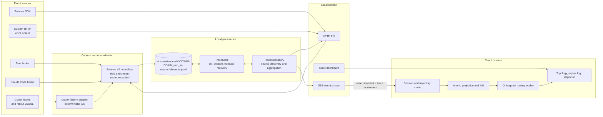
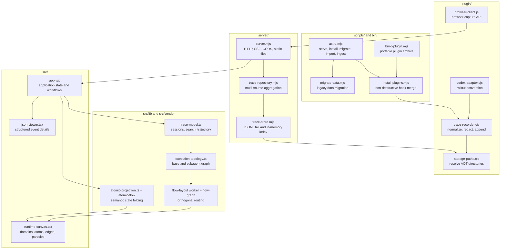
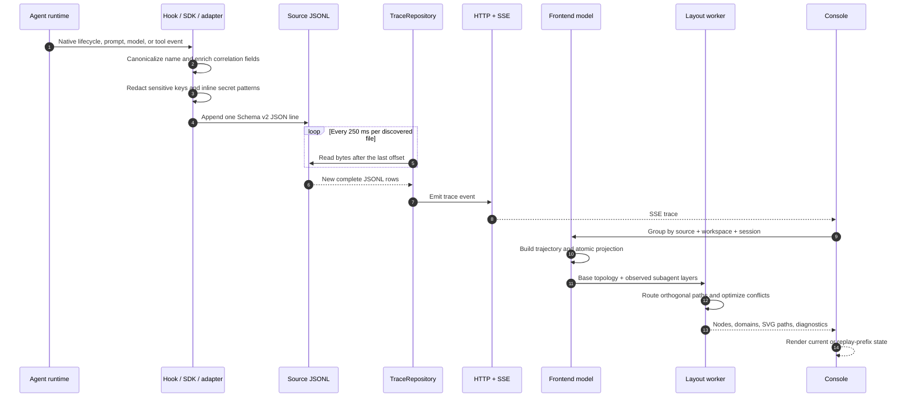
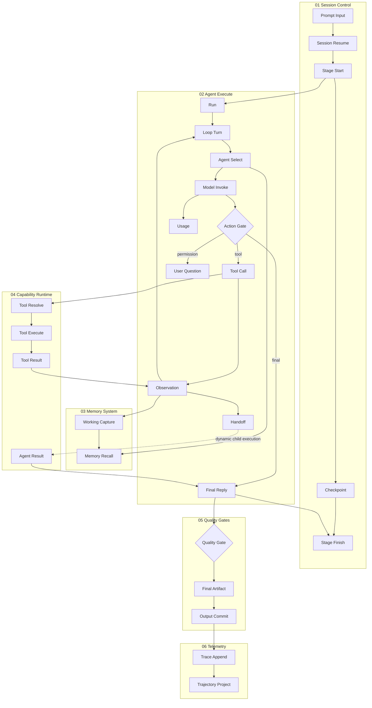
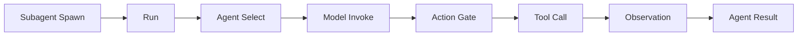

# ASTRO

English | [简体中文](README-zh.md)

**ASTRO** stands for **Agent State Trace & Runtime Observations**. It is an
observability system for coding-agent execution and is unrelated to the Astro
web framework.

Local-first runtime observability, search, and replay for coding agents.
ASTRO gives Trae, Claude Code, Codex, DeepSeek Harness, WorkBuddy / CodeBuddy
Code, OpenCode, browser extensions, and custom clients one versioned event
protocol and one execution console without sending trace data off the machine.


The screenshot shows the complete desktop workspace with both side panels open:
`RUNS` organizes history by session and prompt run, the center canvas renders
the execution topology and atom state, `EVENTS` combines the event stream with
the inspector, and the footer provides event-level seeking and replay. Selecting
an event exposes Overview, Input, Output, and normalized Raw JSON while keeping
the topology node, log entry, and replay cursor synchronized.

## Table of Contents

- [Why ASTRO](#why-astro)
- [Features](#features)
- [Supported Sources](#supported-sources)
- [Quick Start](#quick-start)
- [Architecture](#architecture)
- [Unified Event Protocol](#unified-event-protocol)
- [Execution Topology](#execution-topology)
- [Storage and Migration](#storage-and-migration)
- [Integrations](#integrations)
- [Console Workflows](#console-workflows)
- [Configuration](#configuration)
- [Project Structure](#project-structure)
- [Security and Privacy](#security-and-privacy)
- [Performance and Current Limits](#performance-and-current-limits)
- [Development and Verification](#development-and-verification)
- [Troubleshooting](#troubleshooting)
- [Documentation](#documentation)
- [Contributing](#contributing)
- [License](#license)

## Why ASTRO

Coding-agent runtimes expose different hook names, session identifiers,
payloads, and persistence formats. That makes it difficult to compare runs,
follow a tool call from request to result, inspect a child agent, or replay the
state immediately before a failure.

ASTRO provides a shared local layer:

- **Capture once:** normalize native hooks, historical rollouts, browser SDK
  calls, and HTTP ingestion into the same event envelope.
- **Keep source facts:** raw normalized trace events remain the source of
  truth; topology atoms are a separate semantic projection.
- **Inspect live:** append-only JSONL files are followed by the local service
  and streamed to the browser over Server-Sent Events (SSE).
- **Replay deterministically:** every replay position rebuilds the trajectory,
  atom states, stable edge states, and inspector from an event prefix.
- **Stay local by default:** all supported hooks persist under `~/.astrox`.
  The service binds to loopback unless explicitly configured otherwise.

ASTRO observes agent execution. It does not invoke models,
schedule tools, approve permissions, or alter agent decisions.

## Features

- Versioned `schemaVersion: 2` event envelope across supported clients.
- Source- and workspace-aware session identity to prevent native ID
  collisions.
- Live session updates through SSE; every initial connection and reconnect
  restores a complete snapshot before incremental events.
- Continuous follow-up capture after `Stop`, including repeated prompts and
  answers with identical text.
- Expandable prompt-run history within each session. `INITIAL` and numbered
  `FOLLOW-UP` rows isolate one prompt and all events before the next prompt.
- Active session duration refreshes every second. It is capped at the shared
  24-hour default and becomes `terminated` when that limit is reached.
- Historical replay with restart, previous, play/pause, next, seek, and
  `0.5x`/`1x`/`2x`/`4x` speed controls.
- Two complementary views:
  - **Execution Topology** for semantic runtime structure.
  - **Run Trajectory** for observed time-ordered steps and turns.
- Six base topology domains, 27 stable atoms, and 28 defined edges.
- Dynamic `Subagent Execute` layers derived from `SubagentStart` and
  `SubagentStop`.
- Worker-backed orthogonal edge routing with obstacle avoidance, crossing
  penalties, diagnostics, and a main-thread fallback.
- Animated atom transitions, connected-edge highlighting, and click-to-locate
  behavior.
- Full-event inspection for overview, input, output, and normalized raw JSON.
- Global History search over IDs, locators, prompts, messages, tool I/O, and
  nested payload fields, with time, Agent, status, and event-type filters.
- One-result location across the Session, Prompt run, event log, inspector,
  and mapped topology atom.
- Deep links using `source`, `session`, and `event` query parameters.
- JSON/JSONL import, per-prompt-run JSONL export, and local event clearing.
- Deterministic Codex history imports, making unchanged re-imports idempotent.
- Recursive secret redaction before persistence.
- Light, dark, and system themes; no CDN or remote font dependency.
- Persisted History, Events, theme, and platform preferences under `ASTROX_*` keys.
- Demo data only in development/test; production keeps a truthful empty state.

## Supported Sources

| Source | Live capture | Historical import | Default data file | Integration |
| --- | --- | --- | --- | --- |
| Trae | Yes | JSON/JSONL UI import | `~/.astrox/trae/YYYY/MM-DD/HH_mm_ss-<sessionId>/events.jsonl` | Project hooks |
| Claude Code | Yes | JSON/JSONL UI import | `~/.astrox/claude/YYYY/MM-DD/HH_mm_ss-<sessionId>/events.jsonl` | Native plugin or direct hooks |
| Codex | Yes | Active and archived rollout JSONL | `~/.astrox/codex/YYYY/MM-DD/HH_mm_ss-<sessionId>/events.jsonl` | Native plugin, direct hooks, and adapter |
| DeepSeek Harness | Yes | JSON/JSONL UI import | `~/.astrox/deepseek/YYYY/MM-DD/HH_mm_ss-<sessionId>/events.jsonl` | Native `dsh` bundle |
| WorkBuddy / CodeBuddy Code | Yes | JSON/JSONL UI import | `~/.astrox/workbuddy/YYYY/MM-DD/HH_mm_ss-<sessionId>/events.jsonl` | Native plugin or direct hooks |
| OpenCode | Yes | Native events only | `~/.astrox/opencode/YYYY/MM-DD/HH_mm_ss-<sessionId>/events.jsonl` | Global OpenCode plugin |
| Browser / extension | Yes | JSON/JSONL UI import | `~/.astrox/browser/YYYY/MM-DD/HH_mm_ss-<sessionId>/events.jsonl` | Dependency-free ES module |
| Custom client | Yes | CLI or JSON/JSONL UI import | `~/.astrox/<source>/YYYY/MM-DD/HH_mm_ss-<sessionId>/events.jsonl` | HTTP API or CLI |

Hook support follows the event capabilities exposed by each runtime. Unknown
event names are preserved instead of discarded.

## Quick Start

### Requirements

- A current Node.js LTS release compatible with the package manifest.
- `pnpm` activated through Corepack.
- Codex, Claude Code, DeepSeek Harness, Trae, or WorkBuddy only when installing that runtime integration.
- A modern browser with ES modules, Web Workers, SSE, `ResizeObserver`, and
  modern CSS support.
- An available loopback port. The server starts at `4318` and tries up to 20
  subsequent ports when the preferred port is occupied.

### Install and run

Clone or download the repository, enter its root, and install the pinned
dependencies:

```bash
git clone <repository-url> astro
cd astro
corepack enable
pnpm install
pnpm typecheck
pnpm build
pnpm start
```

Open `http://127.0.0.1:4318`. The server prints the actual URL if it selects a
later port.

In `pnpm dev` development mode, the console loads a built-in Demo when no real
events exist so topology, trajectory, inspection, and replay can be evaluated.
Production builds never synthesize Demo events and preserve the real empty state.
Direct hook installation starts and opens the dashboard automatically.

### Choose an integration

| Runtime | Recommended installation | Scope | Writes to |
| --- | --- | --- | --- |
| Codex | Native `codex-plugin/` | User | `~/.astrox/codex/YYYY/MM-DD/HH_mm_ss-<sessionId>/events.jsonl` |
| Claude Code | Native `claude-plugin/` | User, project, or local | `~/.astrox/claude/YYYY/MM-DD/HH_mm_ss-<sessionId>/events.jsonl` |
| DeepSeek Harness | `deepseek-plugin/` bundle | Profile | `~/.astrox/deepseek/YYYY/MM-DD/HH_mm_ss-<sessionId>/events.jsonl` |
| WorkBuddy / CodeBuddy Code | Native `workbuddy-plugin/` | User, project, or local | `~/.astrox/workbuddy/YYYY/MM-DD/HH_mm_ss-<sessionId>/events.jsonl` |
| OpenCode | Global plugin (`opencode-plugin/`) | User | `~/.astrox/opencode/YYYY/MM-DD/HH_mm_ss-<sessionId>/events.jsonl` |
| Trae | Direct project hooks | Project | `~/.astrox/trae/YYYY/MM-DD/HH_mm_ss-<sessionId>/events.jsonl` |
| Browser / extension | Browser SDK | Client-defined | `~/.astrox/browser/YYYY/MM-DD/HH_mm_ss-<sessionId>/events.jsonl` |
| Custom agent | HTTP API or CLI | Client-defined | `~/.astrox/<source>/YYYY/MM-DD/HH_mm_ss-<sessionId>/events.jsonl` |

Use either the native plugin or direct hooks for the same Codex, Claude Code,
or WorkBuddy
installation, not both. Enabling both records the same lifecycle event twice.

### Native Codex, Claude Code, and WorkBuddy plugins

The repository includes three self-contained native plugin packages:

| Package | Manifest | Hook configuration |
| --- | --- | --- |
| `codex-plugin/` | `.codex-plugin/plugin.json` | `hooks/hooks.json` |
| `claude-plugin/` | `.claude-plugin/plugin.json` | `hooks/hooks.json` |
| `workbuddy-plugin/` | `.codebuddy-plugin/plugin.json` | `hooks/hooks.json` |

Synchronize their embedded recorders, server, and built dashboard before
installation:

```bash
pnpm build:native-plugins
```

Install the Codex plugin from the repository marketplace:

```bash
codex plugin marketplace add /absolute/path/to/astro
codex plugin add astro@astro-local
```

Start a new Codex session, open `/hooks`, and trust the ASTRO
hooks. Codex intentionally skips new or changed command hooks until they are
reviewed.

Test the Claude Code plugin directly:

```bash
claude --plugin-dir /absolute/path/to/astro/claude-plugin
```

Or install it from the repository marketplace:

```bash
claude plugin marketplace add /absolute/path/to/astro
claude plugin install astro@astro-local --scope user
```

Use `--scope project` to write shared project configuration or
`--scope local` for a project-specific, uncommitted installation. Restart
Claude Code or start a new session after enabling the plugin.

The native plugins write to `~/.astrox/codex/YYYY/MM-DD/HH_mm_ss-<sessionId>/events.jsonl` and
`~/.astrox/claude/YYYY/MM-DD/HH_mm_ss-<sessionId>/events.jsonl`. Direct installation starts and opens the
dashboard immediately. Native hooks also ensure it is open at `SessionStart`
and fall back to the first submitted prompt. See the
[Codex plugin guide](codex-plugin/README.md) and
[Claude Code plugin guide](claude-plugin/README.md) for complete usage and
removal instructions.

Validate and install the WorkBuddy / CodeBuddy Code plugin with:

```bash
codebuddy plugin validate ./workbuddy-plugin
codebuddy plugin marketplace add /absolute/path/to/astro
codebuddy plugin install astro@astro-local --scope user
```

See the [WorkBuddy plugin guide](workbuddy-plugin/README.md) for the supported
Hook events and local data layout. The plugin preserves permission,
elicitation, and rate-limit signals as waiting states.

### OpenCode plugin

OpenCode has no hook protocol, so ASTRO ships a global OpenCode plugin that
subscribes to the server event stream:

```bash
pnpm run install-opencode-plugin
```

The plugin is copied to `~/.config/opencode/plugins/astro-capture/`, which
OpenCode discovers automatically, so no `opencode.json` entry is required.
Re-running the command replaces the installed copy, and it removes a stale
absolute-path entry from `opencode.json` if one exists. Start a new session or
run `opencode service restart` to activate it. See the
[OpenCode plugin guide](opencode-plugin/README.md) for the event mapping and
removal steps.

### DeepSeek Harness plugin

DeepSeek Harness uses a Cordis bundle instead of `hooks.json`. Build and
install ASTRO into the `web` profile:

```bash
pnpm build:native-plugins
pnpm install-plugins -- --clients=deepseek --deepseek-profile=web
```

The installer uses `dsh` from PATH and falls back to the official
`npx @deepseek-ai/dsh` launcher when needed. Restart `dsh web` after
installation. Session, prompt, model, tool, and completion events are written
to `~/.astrox/deepseek/.../events.jsonl`. Use `--dsh-home` and
`--deepseek-profile` for non-default installations. See the
[DeepSeek plugin guide](deepseek-plugin/README.md).

### Install agent hooks directly

Run the commands below from this repository after `pnpm install` and
`pnpm build`. To install every supported client at once:

```bash
pnpm install-plugins
```

The installer copies the standalone runtime to `~/.astrox/plugins/astro` for
the hook-based clients. It merges commands into existing hook configurations, preserves
unrelated hooks, and migrates legacy `.agent-trace/events.jsonl`, project-local
`.astrox`, and flat `~/.astrox/<source>/events.jsonl` data unless
`--no-migrate` is set. Installation starts and opens the standalone dashboard;
new Agent sessions reuse it and select the current run.

#### Codex

Install the Codex hooks for the current user:

```bash
pnpm install-plugins -- --clients=codex
```

This updates `$CODEX_HOME/hooks.json`, normally `~/.codex/hooks.json`. For a
custom Codex home:

```bash
pnpm install-plugins -- --clients=codex --codex-home=/path/to/.codex
```

Restart Codex after installation, enter the project to observe, and begin a
new session:

```bash
cd /path/to/workspace
codex
```

New sessions, prompts, tool calls, permission requests, compactions, subagent
events, interruptions, and stops are written to
`~/.astrox/codex/YYYY/MM-DD/HH_mm_ss-<sessionId>/events.jsonl`. Existing Codex rollout history can also be loaded
with `pnpm import-codex`.

#### Claude Code

Install only for one project:

```bash
pnpm install-plugins -- \
  --clients=claude \
  --scope=project \
  --target=/absolute/path/to/workspace
```

This updates `<workspace>/.claude/settings.local.json`. To enable capture for
all Claude Code projects, install at user scope instead:

```bash
pnpm install-plugins -- --clients=claude --scope=user
```

The user-scoped command updates `~/.claude/settings.json`. Restart Claude Code
after installation and start a new session in the observed workspace:

```bash
cd /path/to/workspace
claude
```

Prompt, tool, failure, permission, notification, subagent, compact, and stop
events are written to `~/.astrox/claude/YYYY/MM-DD/HH_mm_ss-<sessionId>/events.jsonl`.

#### Trae

Trae hooks are project-scoped. Install them into the workspace that Trae will
open:

```bash
pnpm install-plugins -- \
  --clients=trae \
  --target=/absolute/path/to/workspace
```

This updates `<workspace>/.trae/hooks.json`. Reopen or reload that workspace
in Trae, start a new Agent conversation, and submit a prompt. Session, prompt,
tool, stop, and notification events are written to
`~/.astrox/trae/YYYY/MM-DD/HH_mm_ss-<sessionId>/events.jsonl` by default.
The sandbox must permit writes to that user-level root. The checked-in hooks and
development API use the same `~/.astrox` root and port `4318` by default. If
`ASTRO_PORT` is overridden, use the same value for Vite and the API process.
Each follow-up prompt and response is recorded in the same session; `Stop`
does not disable listening.

#### View captured runs

No manual start is required by default. The installer starts and opens ASTRO.
After reloading or restarting the client, `SessionStart` then:

1. appends the current Agent event to the source-specific JSONL file;
2. checks the dashboard PID for the preferred port;
3. starts the installed `plugins/astro/server/server.mjs` only when needed;
4. opens the actual URL only when starting the server, including a later port
   when `4318` is occupied. If already running, it reports the current session's
   URL so you can switch to or refresh the existing tab without opening another.

To manage the process manually, disable automatic startup and use either
entry point:

```bash
ASTRO_AUTO_OPEN=0 pnpm start
# All clients share the user-level runtime and data root.
node ~/.astrox/plugins/astro/server/server.mjs
```

Select the new run in **Run History**, then choose Codex, Claude Code, DeepSeek,
Trae, or WorkBuddy in the platform selector. The server is required for live browser updates,
but hooks continue writing local JSONL while it is stopped. Set
`ASTRO_AUTO_OPEN=0` to keep prompt-triggered startup disabled.

To confirm capture independently of the UI:

```bash
find ~/.astrox -type f -name events.jsonl -print
tail -n 1 ~/.astrox/codex/YYYY/MM-DD/HH_mm_ss-<sessionId>/events.jsonl
tail -n 1 ~/.astrox/claude/YYYY/MM-DD/HH_mm_ss-<sessionId>/events.jsonl
tail -n 1 ~/.astrox/deepseek/YYYY/MM-DD/HH_mm_ss-<sessionId>/events.jsonl
tail -n 1 ~/.astrox/trae/YYYY/MM-DD/HH_mm_ss-<sessionId>/events.jsonl
tail -n 1 ~/.astrox/workbuddy/YYYY/MM-DD/HH_mm_ss-<sessionId>/events.jsonl
```

Only the file for a client that has emitted an event is expected to exist.

| Client | Configuration target | Installed event coverage |
| --- | --- | --- |
| Trae | `<workspace>/.trae/hooks.json` | Session start, prompt, tool start/result, stop, notification |
| Claude Code | `~/.claude/settings.json` or `<workspace>/.claude/settings.local.json` | Session, prompt, tool, failure, permission, notification, subagent, compact, stop |
| Codex | `$CODEX_HOME/hooks.json` | Session, prompt, tool, permission, compaction, subagent, interrupt, stop |
| DeepSeek Harness | `$DSH_HOME/profiles/<profile>/package.json` | Session, prompt, model response, tool, reasoning, completion, interrupt |
| WorkBuddy | `$CODEBUDDY_HOME/settings.json` or `<workspace>/.codebuddy/settings.json` | Session, prompt, tool, permission, notification, task, elicitation, compaction, failure, stop |

Additional options:

```bash
pnpm install-plugins -- --clients=trae,claude
pnpm install-plugins -- --clients=deepseek --deepseek-profile=web
pnpm install-plugins -- --clients=workbuddy --scope=user
pnpm install-plugins -- --astro-home=/path/to/.astrox
pnpm install-plugins -- --no-migrate
```

### Development mode

Vite resolves its `/api` proxy from `ASTRO_HOST/ASTRO_PORT`; the default is
`http://127.0.0.1:4318`. Run the API and frontend separately:

```bash
# Terminal 1
ASTRO_HOME="$HOME/.astrox" pnpm start

# Terminal 2
pnpm dev
```

Open the URL printed by Vite, normally `http://127.0.0.1:5173`.

## Architecture

### Design boundaries

- **Observation only:** capture must not influence the agent execution path.
- **Raw facts before projections:** `TraceEvent` records are durable facts;
  atoms and trajectories are rebuildable views.
- **Local-first persistence:** no database, cloud collector, or CDN is
  required.
- **Fail-open capture:** recorder failures exit successfully so a hook cannot
  block the agent; Codex uses quiet output while compatible clients receive
  `{"continue":true}`.
- **Portable protocol:** JSONL and HTTP ingestion keep integrations independent
  of the React UI.

### System context



### Repository components



### End-to-end event flow



## Unified Event Protocol

All persisted events use a `schemaVersion: 2` envelope. The frontend also
normalizes earlier or raw hook-like payloads during import.

```json
{
  "schemaVersion": 2,
  "id": "evt-01",
  "capturedAt": "<ISO-8601 timestamp>",
  "source": "custom-agent",
  "sourceVersion": "1.0.0",
  "workspaceId": "workspace-01",
  "sessionId": "session-01",
  "turnId": "turn-01",
  "parentId": null,
  "eventName": "PreToolUse",
  "nativeEventName": "before_tool",
  "toolUseId": "call-01",
  "toolName": "readFile",
  "cwd": "/path/to/workspace",
  "status": null,
  "sequence": 4,
  "payload": {
    "tool_input": {
      "path": "README.md"
    }
  },
  "locator": "trace://custom-agent/session-01/evt-01"
}
```

| Field | Type | Meaning |
| --- | --- | --- |
| `schemaVersion` | number | Persisted protocol version; recorder writes `2` |
| `id` | string | Global event ID; Codex imports use deterministic hashes |
| `capturedAt` | ISO 8601 string | Capture timestamp |
| `source` | string | Normalized client name |
| `sourceVersion` | string or null | Optional client version |
| `workspaceId` | string | Explicit ID or first 12 SHA-256 characters of absolute `cwd` |
| `sessionId` | string | Native client session ID |
| `turnId` | string or null | Optional turn correlation |
| `parentId` | string or null | Parent or subagent correlation |
| `eventName` | string | Canonical event name |
| `nativeEventName` | string | Original source event name |
| `toolUseId` | string or null | Tool start/result correlation |
| `toolName` | string or null | Tool or capability name |
| `cwd` | string or null | Runtime working directory |
| `status` | string or null | Native or inferred status |
| `sequence` | number or null | Optional source sequence |
| `payload` | object | Redacted source payload |
| `locator` | string | `trace://source/session/event` locator |

### Canonical event types

| Category | Events |
| --- | --- |
| Session | `SessionStart`, `SessionEnd`, `Interrupt` |
| Turn | `Stop`, `StopFailure` |
| Input and output | `UserPromptSubmit`, `AgentMessage`, `Reasoning` |
| Tools | `PreToolUse`, `PostToolUse`, `PostToolUseFailure` |
| Interaction | `PermissionRequest`, `Elicitation`, `ElicitationResult`, `Notification` |
| Subagents | `SubagentStart`, `SubagentStop` |

Unknown native names are retained and displayed as unknown events. Source
session IDs are isolated with the compound key:

```text
source::workspaceId::sessionId
```

There are 17 canonical event types. The event log displays `Notification` as
`user.question` (`AskUserQuestion`) while retaining the original event fields.
`Stop` completes one response; a later `UserPromptSubmit` makes the same
session active again. See the
[Event Protocol Reference](docs/event-protocol-en.md) for complete fields,
source mappings, ordering, and the SSE contract.

## Execution Topology

The topology is a semantic projection, not a claim that every runtime exposes
each internal operation. Nodes backed by direct evidence contain bound event
IDs; structurally projected subagent nodes without evidence are marked
`INFERRED`.



| Domain | Atoms | Responsibility |
| --- | ---: | --- |
| Session Control | 5 | Prompt normalization, session state, stage lifecycle, checkpoints |
| Agent Execute | 11 | Run loop, routing, model decisions, tools, handoffs, interaction, final reply |
| Memory System | 2 | Context recall and working-memory capture |
| Capability Runtime | 4 | Tool resolution, execution, result publication, and normalized agent results |
| Quality Gates | 3 | Response validation, artifact materialization, output commit |
| Telemetry | 2 | Trace append and replayable trajectory projection |

Conditional edges appear only when relevant evidence exists:

- Tool paths require at least one `PreToolUse`.
- Question paths require at least one `PermissionRequest`.
- Completion paths require `Stop` or `SessionEnd`.
- Subagent paths require `SubagentStart`.

Each observed child agent adds this dynamic layer:



Layout runs in a Web Worker. The router expands nodes and domain headers into
obstacles, builds a horizontal/vertical visibility graph, scores length,
bends, collisions, overlap, proximity, and port deviation, then reroutes
conflicting edges. Current defaults include a `12 px` clearance, `32` bend
penalty, `960` crossing penalty, `16 px` parallel gap, and up to `32`
optimization passes.

## Storage and Migration

### Default layout

```text
~/.astrox/
  plugins/
    astro/
      plugin.json
      dist/
      plugin/
        storage-paths.cjs
        trace-recorder.cjs
      server/
  claude/
    YYYY/MM-DD/HH_mm_ss-<sessionId>/events.jsonl
  codex/
    YYYY/MM-DD/HH_mm_ss-<sessionId>/events.jsonl
  trae/
    YYYY/MM-DD/HH_mm_ss-<sessionId>/events.jsonl
  browser/
    YYYY/MM-DD/HH_mm_ss-<sessionId>/events.jsonl
  <custom-source>/
    YYYY/MM-DD/HH_mm_ss-<sessionId>/events.jsonl
```

Source names are normalized to lowercase filesystem-safe names. The server
discovers source directories every `500 ms`; each file store checks appended
bytes every `250 ms`.

`TraceStore` provides:

- append-only JSONL persistence;
- in-process event lookup;
- duplicate suppression by event ID when appending through the service;
- byte-offset incremental reads;
- full reload and SSE `reset` after truncation;
- malformed-line isolation so a bad row does not hide later valid rows.

### Legacy migration

The direct Hook installer (`pnpm install-plugins` or `astro-trace install`)
performs idempotent migrations by default:

1. Existing `HH:mm:ss-<sessionId>` directories under `ASTRO_HOME` are renamed
   to the canonical `HH_mm_ss-<sessionId>` layout.
2. `<workspace>/.agent-trace/events.jsonl` is split by event source.
3. Existing flat `~/.astrox/<source>/events.jsonl` files are split into
   `~/.astrox/<source>/YYYY/MM-DD/HH_mm_ss-<sessionId>/events.jsonl` files.
4. Existing `<workspace>/.astrox/<source>/events.jsonl` files, including Trae
   captures, are copied into the same user-level layout.

Layout migration removes a legacy directory only after a successful rename or
conflict-safe merge. Imported source files are never deleted. Existing event
IDs are skipped, and repeated migration is safe. Run migration explicitly with:

```bash
node bin/astro.mjs migrate
node bin/astro.mjs migrate /path/to/events.jsonl
node bin/astro.mjs migrate /path/to/.agent-trace
node bin/astro.mjs migrate ~/.astrox
```

Native Codex or Claude Code plugin installation does not execute repository
scripts, so run `node bin/astro.mjs migrate` once when upgrading through a
native plugin only.

Migration re-normalizes records and skips IDs already present at the
destination. Use `--no-migrate` during hook installation to leave legacy data
untouched.

After verifying `~/.astrox`, an old project-local `.astrox` directory may be
archived or removed manually. ASTRO never deletes it.

Set `ASTRO_TRACE_DIR` to override the default trace root. Files inside that
root are still partitioned by time and session.

## Integrations

### CLI

Run the repository CLI directly:

```text
node bin/astro.mjs serve
node bin/astro.mjs install [--clients trae,claude,codex,deepseek,workbuddy] [--scope user|project]
node bin/astro.mjs doctor [--scope user|project] [--deepseek-profile web]
node bin/astro.mjs migrate [FILE_OR_DIR]
node bin/astro.mjs import-codex [FILE ...] [--codex-home DIR]
node bin/astro.mjs ingest [FILE] [--source NAME]
```

Examples:

```bash
node bin/astro.mjs install \
  --target /path/to/workspace \
  --clients trae,claude

node bin/astro.mjs ingest ./trace.jsonl \
  --source custom-agent

printf '%s\n' \
  '{"sessionId":"s1","eventName":"AgentMessage","payload":{"message":"Done"}}' \
  | node bin/astro.mjs ingest --source custom-agent
```

### Codex history

Import all persisted active and archived sessions from `$CODEX_HOME`:

```bash
pnpm import-codex
```

Import selected rollout files or use a custom Codex home:

```bash
node bin/astro.mjs import-codex /path/to/rollout.jsonl
node bin/astro.mjs import-codex --codex-home=/path/to/.codex
```

IDs are derived from file path, row index, timestamp, event type, and call ID.
Re-importing unchanged files is idempotent.

### Browser SDK

`plugin/browser-client.js` is a dependency-free ES module:

```js
import { createAstroClient } from "./plugin/browser-client.js";

const trace = createAstroClient({
  source: "browser",
  workspaceId: "my-extension",
});

await trace.startSession({ extension: "my-extension" });
await trace.submitPrompt("Inspect the current page");

const call = await trace.startTool(
  "querySelector",
  { selector: "main" },
);

await trace.finishTool(
  "querySelector",
  call.toolUseId,
  { matches: 1 },
);

await trace.agentMessage("Inspection finished");
await trace.stop({ message: "Done" });
```

The SDK sends to `http://127.0.0.1:4318/api/events` by default. Browser
extensions must declare loopback host permission. Only ingestion enables CORS;
read, search, and SSE endpoints remain same-origin.

### HTTP API

| Method | Path | Purpose |
| --- | --- | --- |
| `GET` | `/api/health` | Status, total event count, data root, and discovered files |
| `GET` | `/api/events` | Read events; optionally filter by `source` and `session` |
| `GET` | `/api/events/:eventId` | Exact event lookup |
| `POST` | `/api/events` | Ingest one event, an array, or `{ "events": [...] }` |
| `DELETE` | `/api/events` | Truncate all currently discovered local trace files |
| `GET` | `/api/search?q=` | Search nested fields with optional source/session filters |
| `GET` | `/api/stream` | Receive `ready`, `trace`, and `reset` SSE events |

Ingest one event:

```bash
curl -X POST http://127.0.0.1:4318/api/events \
  -H 'Content-Type: application/json' \
  -H 'X-Astro-Source: custom-agent' \
  -d '{
    "sessionId": "s1",
    "eventName": "AgentMessage",
    "payload": {
      "message": "Done"
    }
  }'
```

Read and search:

```bash
curl http://127.0.0.1:4318/api/health
curl 'http://127.0.0.1:4318/api/events?source=codex&session=s1'
curl 'http://127.0.0.1:4318/api/search?q=readFile&source=codex'
curl -N http://127.0.0.1:4318/api/stream
```

## Console Workflows

### Run history

Sessions are grouped by `source::workspaceId::sessionId`. Each parent row shows
status, a title derived from the first prompt, start time, source, duration,
prompt count, and an abbreviated session ID. A session with multiple prompts
expands into `INITIAL` and numbered `FOLLOW-UP` rows. Each child row shows its
own title, status, start time, duration, event count, and prompt event ID.

Selecting a child scopes topology, trajectory, log, inspector, replay, and
export to the interval beginning at that `UserPromptSubmit` and ending before
the next prompt. Selecting the parent opens the latest prompt run. The active
session expands automatically, follows a newly arriving prompt while Live is
active, and keeps the selected child visible inside the bounded prompt list.
Active duration refreshes once per second, stops after completion, and is
capped at 24 hours by default. Reaching that limit derives a `terminated`
display state and stops live animation without rewriting stored events.
History and Events can collapse into narrow rails; their states persist in
`ASTROX_HISTORY_OPEN` and `ASTROX_CONSOLE_OPEN`.

#### Live-run timeout contract

The timeout is a frontend safety policy for stale live displays, not a capture
event or a server-side session lease.

| Case | Duration shown | Effective UI status | Stored trace |
| --- | --- | --- | --- |
| Active run at `limit - 1 ms` | Still advances | `active` | Unchanged |
| Active run at exactly `limit` | Capped at the limit | `terminated` | Unchanged |
| Waiting Prompt at the limit | Capped at the limit | `terminated` | Unchanged |
| Parent row whose latest Prompt is waiting | Frozen at the recorded parent duration | `waiting` | Unchanged |
| Already complete, failed, or terminated | Preserves the recorded duration, even above the limit | Preserves the terminal status | Unchanged |

The parent Session row and nested Prompt rows intentionally have different
clock rules. A parent advances only while its latest Prompt is `active`; a
nested Prompt advances while it is `active` or `waiting`. Both advancing paths
use the same limit. The selected run is considered Live only while its
effective status is `active`, so an expired selection also stops topology
transitions and running log markers. Reloading the page calculates the same
result again from timestamps and current time.

#### Global history search

Use the header search control or `Cmd/Ctrl + K` to search all History data
already loaded in the browser. The default range is the last three hours;
presets cover 3, 6, 12, and 24 hours, today, yesterday, and seven days. Agent,
run-status, event-category, and date filters can be combined.

Search results include their Session and Prompt context. Selecting one switches
the platform when supported, selects the exact run and event, exits replay,
opens History and Events, and independently locates the matching log row and
topology atom. Results render in automatic batches. This client-side search is
separate from `/api/search` and only covers loaded data.

### Topology and trajectory

- **Topology view** shows stable semantic atoms and paths, dynamic
  subagent layers, atom state, event counts, and animated transitions.
- **Trajectory view** prioritizes observed order and groups steps by turn and
  Input / Model / Tools lanes.
- Matching `PreToolUse` and `PostToolUse` or `PostToolUseFailure` records with
  the same `toolUseId` become one tool step with duration and paired I/O.
- Runtime-only mode hides deep implementation atoms to reduce visual density.

### Event log and inspector

The event log searches the selected prompt run in browser memory, groups by
turn, selects events, and locates mapped topology atoms. Sessions without a
prompt event retain a session-level fallback. The inspector exposes:

- overview metadata and status;
- prompt or tool input;
- response or tool output;
- full normalized event JSON;
- atom contract, ports, gate state, and bound event when an atom is selected.

The server-side `/api/search` endpoint is broader and can search all selected
server records; the UI log search does not call that endpoint.

### Replay

Replay never mutates source data. For cursor position `n`, the UI rebuilds all
derived state from the selected prompt run:

```js
events.slice(0, n + 1)
```

This includes trajectory steps, atomic instances, stable edge states, active
transition, and selected inspector event.

### Import, export, and deep links

- Import accepts JSON arrays and one-object-per-line JSONL.
- Imported events remain in browser memory and are not persisted by the
  server.
- Export downloads the selected prompt run as
  `astro-<source>-<sessionId>-prompt-<number>.jsonl`. A session without a
  prompt falls back to `astro-<source>-<sessionId>.jsonl`.
- Clear removes browser imports and calls `DELETE /api/events` outside demo
  mode.
- Current selection is encoded as
  `?source=<source>&session=<sessionId>&event=<eventId>`.

## Configuration

Installation creates one shared configuration for every Agent, CLI command,
dashboard process, and the Vite development proxy:

```text
~/.astrox/plugins/astro/
├── config.yaml
└── .env
```

The repository's `config.example.yaml` and `.env.example` are templates only.
The installer copies them to the paths above on first installation and never
overwrites the active files during upgrades. Edit `config.yaml` for normal
settings:

```yaml
server:
  host: 127.0.0.1
  port: 4318
  maxBodyBytes: 5242880
runtime:
  autoOpen: true
```

Use `.env` for local or sensitive values referenced by YAML:

```yaml
integrations:
  example:
    apiKey: ${EXAMPLE_API_KEY}
```

```dotenv
EXAMPLE_API_KEY=replace-with-a-local-secret
```

Process variables override plugin `.env`, which overrides `config.yaml`.
Explicit CLI options have the highest priority. `ASTRO_HOME` is the bootstrap
location and must be supplied before installation or with `--astro-home`; it
cannot be set by the plugin's own `.env`.

Run `astro-trace doctor` to verify both files without displaying secret values.
Restart the Agent or ASTRO process after editing them.

For upgrades, `AOT_HOME`, `AGENT_TRACE_HOST`, `AGENT_TRACE_PORT`,
`AGENT_TRACE_MAX_BODY_BYTES`, `AGENT_TRACE_DIR`, `AGENT_TRACE_PROJECT_DIR`,
and the older `TRAE_TRACE_*` names remain supported as deprecated fallbacks.
New deployments should use only `ASTRO_*`.

The frontend timeout policy is the build-time constant
`appTimings.activeRunTimeoutMs` in `src/config/app-config.ts`. It defaults to
`24 * 60 * 60 * 1_000`; change that one value to adjust the live-run limit,
then rebuild the frontend with `pnpm build`. It is intentionally not an
`ASTRO_*` environment variable or browser preference, so every surface in one
build uses the same policy.

## Project Structure

```text
.
├── .agents/plugins/             # Codex local marketplace
├── .claude-plugin/              # Claude Code local marketplace
├── .codebuddy-plugin/           # WorkBuddy local marketplace
├── bin/                         # astro-trace CLI
├── claude-plugin/               # native Claude Code plugin
├── codex-plugin/                # native Codex plugin
├── deepseek-plugin/             # DeepSeek Harness bundle
├── workbuddy-plugin/            # WorkBuddy / CodeBuddy Code native plugin
├── docs/                        # architecture, manuals, and local assets
├── plugin/                      # recorder, adapters, storage paths, browser SDK
├── scripts/                     # hook install, migration, plugin packaging
├── server/                      # HTTP/SSE service and JSONL repositories
├── src/
│   ├── components/              # console, canvas, inspector, local UI source
│   ├── config/                  # atom definitions and platform mappings
│   ├── lib/                     # sessions, topology, projection, layout clients
│   ├── vendor/atomic-flow/      # atomic event protocol and fold state
│   └── vendor/flow-graph/       # orthogonal routing implementation
├── tests/                       # Node test suite
├── .env.example
├── config.example.yaml
├── AGENTS.md                    # repository guidance for coding agents
├── package.json
└── vite.config.ts
```

The frontend uses React 19, strict TypeScript, Vite, Tailwind CSS, local
shadcn/ui source, Lucide icons, and locally bundled Geist fonts.

## Security and Privacy

### Implemented controls

- Loopback binding by default.
- Local JSONL persistence with no remote database.
- Recursive redaction for key names matching authorization, cookies,
  passwords, secrets, API keys, tokens, credentials, and private keys.
- Inline pattern redaction for Bearer tokens, `sk-` keys, common secret
  assignments, and JWT-like values.
- Static-file path containment under `dist`.
- Configurable request-body limit.
- Fail-open hooks that do not interrupt agent execution.
- Same-origin read, search, delete, and SSE endpoints.

### Operational cautions

- Redaction is rule-based, not a complete data-loss-prevention system. Review
  payloads before sharing traces.
- Prompts, file paths, tool input, and tool output may contain sensitive
  project information even when no credential pattern is present.
- `DELETE /api/events` has no authentication because the default trust
  boundary is local-only.
- Do not bind to `0.0.0.0` or expose the service through a public network
  without TLS, authentication, authorization, and network controls.
- Back up `~/.astrox` or export important sessions before clearing data.

## Performance and Current Limits

- JSONL is portable and efficient for local append workloads, but the project
  currently has no built-in rotation, compression, retention, or archival.
- The service retains all discovered events in memory.
- `GET /api/events` returns the complete matching set; there is no pagination.
- Search scans event fields and nested payload values without an index.
- The browser loads all events and builds sessions in memory.
- The router accepts up to 500 nodes and 1,000 edges by default.
- Layout results are cached by session, platform, panel state, and graph
  structure.
- The service has no authentication or multi-user isolation.
- UI imports are browser-memory only and disappear after a page reload.

Long-running or team deployments should add indexed storage, retention,
pagination or streaming history, authentication, and archival before use.

### Failure and degradation behavior

| Scenario | Behavior |
| --- | --- |
| Malformed JSONL row | Skip that row and continue reading later valid rows |
| Trace file truncation | Reload the file and broadcast an SSE `reset` |
| Duplicate event ID through API/repository | Ignore the duplicate append |
| SSE disconnect | Display `offline`; reconnect and restore the full event snapshot before live updates |
| Layout Worker unavailable | Dynamically load the same router on the main thread |
| Router cannot find an optimal path | Return diagnostics and fallback routes where possible |
| No events | Development/test shows Demo; production preserves the real empty state |
| Hook parse or write failure | Report on stderr and exit successfully; Codex quiet mode preserves stdout compatibility |
| Dashboard launch or browser open failure | Keep writing trace data and retry after a stale PID is detected |
| Active or waiting Prompt reaches the timeout | Cap its advancing duration, derive `terminated`, and stop selected-run live effects without appending an event |

## Development and Verification

Run the complete automated checks:

```bash
pnpm test
pnpm typecheck
pnpm build
pnpm build:native-plugins
```

The automated suite covers:

- normalization, secret redaction, and source-specific storage;
- first-prompt dashboard launch and PID-based duplicate prevention;
- hook configuration merge and standalone runtime installation;
- native Codex, Claude Code, and WorkBuddy plugin manifests, hook paths, and recorder sync;
- executable Claude Hook validation across every declared lifecycle handler;
- legacy migration;
- Codex adaptation and deterministic deduplication;
- session isolation and nested search;
- tool start/result pairing and trajectory construction;
- dynamic child-agent topology;
- strict atomic sequence projection and state folding;
- orthogonality of visible graph edges;
- repository aggregation, store deduplication, and exact lookup;
- continuous multi-turn capture after `Stop` in all hook clients;
- prompt-run partitioning, initial/follow-up classification, and per-run status;
- initial SSE snapshots, live increments, and reconnect repair;
- active duration refresh, 24-hour timeout, and `terminated` display state;
- `ASTROX_` preference persistence and legacy-key migration;
- production Demo isolation and Vite proxy environment resolution.

The current suite contains 182 tests.

Useful scripts:

| Command | Purpose |
| --- | --- |
| `pnpm dev` | Start the Vite frontend development server |
| `pnpm start` | Start the local API and production static server |
| `pnpm test` | Run Node tests |
| `pnpm typecheck` | Run TypeScript without emitting files |
| `pnpm build` | Build the production frontend |
| `pnpm build:native-plugins` | Synchronize native plugin recorders, server, and dashboard |
| `pnpm install-plugins` | Install supported hooks |
| `pnpm import-codex` | Import active and archived Codex history |
| `pnpm build:plugin` | Build the portable hook plugin archive |

### Portable plugin package

Build:

```bash
pnpm build:plugin
```

The generated `.tgz` archive is written to `artifacts/`.

Install the archive from another workspace:

```bash
pnpm dlx /absolute/path/to/astro-plugin.tgz install \
  --clients codex,claude,deepseek,workbuddy \
  --scope user

node ~/.astrox/plugins/astro/server/server.mjs
```

The archive includes the hook recorder, server, and built dashboard with no
runtime npm dependencies. See the
[plugin installation guide](docs/plugin-installation.md).

## Troubleshooting

### The UI shows demo data

Demo is expected only in development/test when the real event count is zero.
Production should remain empty; if it shows Demo, check for a Vite development
page or stale build:

```bash
curl http://127.0.0.1:4318/api/health
curl http://127.0.0.1:4318/api/events
```

### Agent activity does not appear

Check that:

1. The client hook file exists and includes the ASTRO command.
2. `~/.astrox/plugins/astro/plugin/trace-recorder.cjs` exists.
3. The hook and server resolve the same `ASTRO_HOME`.
4. The agent session started after hook installation.
5. The expected `~/.astrox/<source>/YYYY/MM-DD/HH_mm_ss-<sessionId>/events.jsonl` is receiving lines; for
   Trae, check `~/.astrox/trae/YYYY/MM-DD/HH_mm_ss-<sessionId>/events.jsonl`.
6. `/api/health` lists that file in `traceFiles`.

### The dashboard does not open automatically

Confirm hooks were installed after `pnpm build`, then verify
`~/.astrox/plugins/astro/dist/index.html` and `server/server.mjs` exist. Remove
a stale `<data-root>/dashboard-<port>.pid` and submit another prompt, or run
the matching installed `plugins/astro/server/server.mjs` directly. Automatic
startup is intentionally disabled when `ASTRO_AUTO_OPEN=0`.

### The console reports `offline`

Verify the service URL and `/api/stream`. In development, Vite and the API
must share `ASTRO_HOST/ASTRO_PORT`; the default port is `4318`.

### The first turn appears but follow-ups do not

`Stop` completes only the current response and does not disable capture.
Confirm JSONL grows during the second turn, hook and service use the same
`ASTRO_HOME`, the client was reloaded after hook changes, and an SSE reconnect
starts with a full-session `reset`. Persistence failures appear on hook stderr
as `ASTRO event was not recorded`.

### Data reappears after clear

A running hook can append another event immediately after truncation. Stop the
active agent session before clearing if an empty store is required.

### Codex imports look duplicated

Unchanged imports are idempotent. Moving a rollout file, changing row order, or
changing row content changes deterministic IDs and can create new records.

### Topology remains in routing state

Large subagent graphs require more layout work. Inspect the browser console
for Worker errors; the main-thread fallback can briefly block rendering.

## Documentation

| Document | English | 简体中文 |
| --- | --- | --- |
| Architecture | [English architecture](docs/architecture-en.md) | [中文架构说明](docs/architecture-zh.md) |
| User manual | [English user manual](docs/user-manual-en.md) | [中文使用手册](docs/user-manual-zh.md) |
| Event protocol | [Event protocol](docs/event-protocol-en.md) | [事件协议参考](docs/event-protocol-zh.md) |
| Operations | [Operations](docs/operations-en.md) | [运维与故障处理](docs/operations-zh.md) |
| Implementation status | [Implementation details](docs/implementation-details-en.md) | [实现细节与规划状态](docs/implementation-details-zh.md) |
| Runtime status and timeout | [Protocol state rules](docs/event-protocol-en.md#7-session-state-and-duration) | [协议状态规则](docs/event-protocol-zh.md#7-会话状态与持续时间) |
| Plugin installation | [Plugin guide](docs/plugin-installation.md) | Same document |
| Project presentation | — | [中文项目分享演示](docs/project-overview-slides-zh.html) |
| Technical interview deep dive | — | [中文技术面试深讲](docs/project-interview-zh.html) |

## Contributing

Issues and pull requests should include enough trace context to reproduce the
behavior without exposing secrets.

1. Create a focused branch.
2. Keep changes within the relevant capture, service, domain, layout, or UI
   boundary.
3. Add or update tests for behavioral changes.
4. Run `pnpm test`, `pnpm typecheck`, and `pnpm build`.
5. Describe event-schema, storage, API, UI, and compatibility impact in the
   pull request.

For protocol changes, preserve unknown fields where possible, document
compatibility behavior, and update both language versions of the README and
the relevant architecture or user manual.

## License

This repository does not currently include a `LICENSE` file, and
`package.json` marks the package as private. Source availability alone does
not grant permission to use, modify, or redistribute the project.

Before publishing this as an open-source release, the maintainers must choose
and add an explicit license, then align package metadata and the portable
plugin package with that license.
