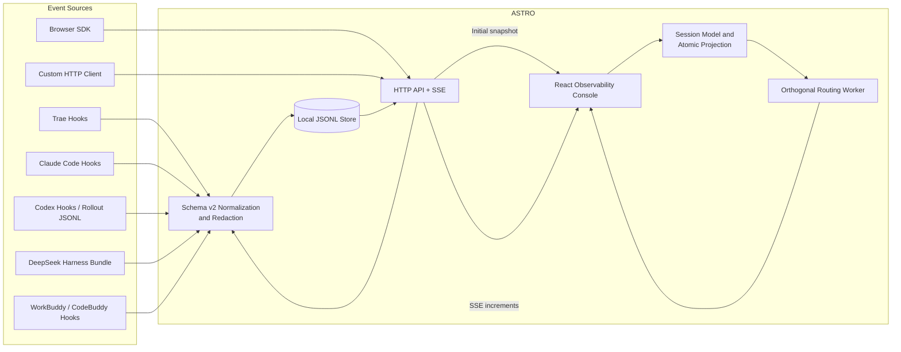
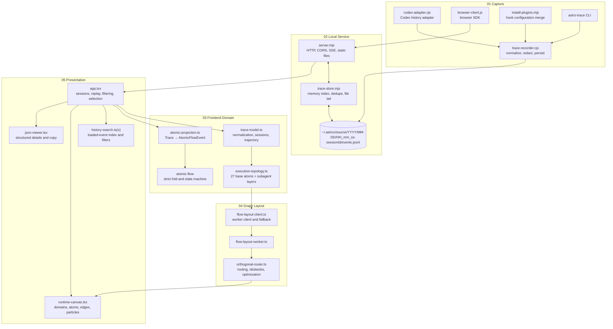
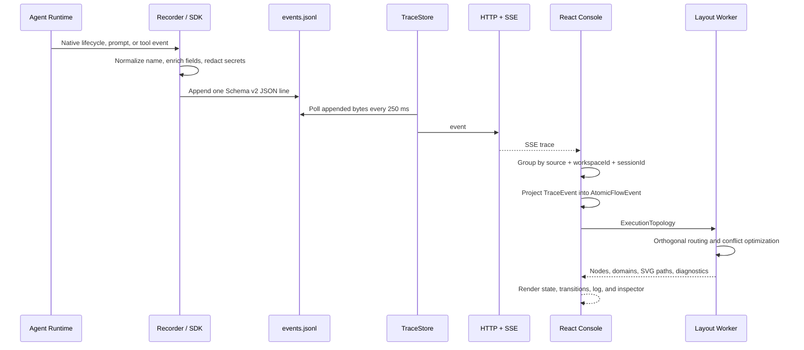

# ASTRO Architecture

> Scope: capture plugins, local service, event model, atomic projection, topology layout, and React console in this repository

## 1. Purpose and Boundaries

ASTRO expands to **Agent State Trace & Runtime Observations**.

ASTRO is a local-first runtime observability platform for coding agents. It normalizes heterogeneous events from Trae, Claude Code, Codex, DeepSeek Harness, WorkBuddy / CodeBuddy Code, browser extensions, and custom clients into a versioned trace envelope, persists those events in local JSONL, and provides live inspection, search, and historical replay.

The system has three explicit boundaries:

- It observes agent execution; it does not invoke models, schedule tools, or alter agent decisions.
- Raw trace events are the source of truth. Atoms are semantic projections used for visualization.
- Data remains on the host by default, with no remote database or CDN dependency.

## 2. System Context



## 3. Container and Component Architecture



## 4. End-to-End Data Flow



## 5. Unified Event Protocol

The persisted protocol is `schemaVersion: 2`. The frontend also accepts earlier envelopes and fills missing normalized fields while reading.

| Field | Type | Meaning |
| --- | --- | --- |
| `schemaVersion` | number | Recorder currently writes `2` |
| `id` | string | Global event ID; Codex history uses deterministic hashes |
| `capturedAt` | ISO 8601 string | Capture timestamp |
| `source` | string | Normalized source, such as `trae`, `claude`, `codex`, `workbuddy`, or `browser` |
| `sourceVersion` | string \| null | Source client version |
| `workspaceId` | string | Workspace identity; defaults to the first 12 SHA-256 characters of absolute `cwd` |
| `sessionId` | string | Native source session ID |
| `turnId` | string \| null | Optional turn correlation |
| `parentId` | string \| null | Parent or subagent correlation |
| `eventName` | string | Canonical event name |
| `nativeEventName` | string | Original source event name |
| `toolUseId` | string \| null | Tool call correlation ID |
| `toolName` | string \| null | Tool or capability name |
| `cwd` | string \| null | Runtime working directory |
| `status` | string \| null | Source status or inferred failure |
| `sequence` | number \| null | Optional source sequence |
| `payload` | object | Redacted source payload |
| `locator` | string | `trace://source/session/event` locator |

### 5.1 Canonical Event Types

The model recognizes 17 canonical types:

`SessionStart`, `SessionEnd`, `Interrupt`, `UserPromptSubmit`, `AgentMessage`,
`Reasoning`, `PreToolUse`, `PostToolUse`, `PostToolUseFailure`,
`PermissionRequest`, `Elicitation`, `ElicitationResult`, `Notification`,
`SubagentStart`, `SubagentStop`, `Stop`, and `StopFailure`. The event log labels
`Notification` as `user.question` (`AskUserQuestion`) without rewriting the
persisted event.

Unknown event names are retained and presented as `Unknown`.

`Stop` completes one response; it does not end session capture. Later prompts,
messages, tools, and stop events with the same `sessionId` continue appending to
the original session file.

### 5.2 Session Isolation

The session key is:

```text
source::workspaceId::sessionId
```

This prevents collisions when different agent platforms use the same native session ID.

## 6. Capture and Adapters

### 6.1 Hook Capture

`scripts/install-plugins.mjs` merges configuration without replacing existing hooks:

- Trae: `<workspace>/.trae/hooks.json`
- Claude Code: `<workspace>/.claude/settings.local.json`
- Codex: `$CODEX_HOME/hooks.json`, normally `~/.codex/hooks.json`
- WorkBuddy: `<workspace>/.codebuddy/settings.json` or
  `$CODEBUDDY_HOME/settings.json`

Hooks pass native events through standard input to `plugin/trace-recorder.cjs`.
Parse or persistence failures still exit successfully, so observability cannot
interrupt the agent execution path, while a persistence or dashboard diagnostic
is written to stderr instead of being silently discarded. Claude Code, Trae,
and WorkBuddy receive `{"continue":true}`; Codex uses quiet mode to keep stdout empty because
some Codex hook events do not accept a control object. All clients use the same
user-level `~/.astrox` data and runtime root.

On `SessionStart` or `UserPromptSubmit`, the recorder also checks
`<data-root>/dashboard-<port>.pid`. If the dashboard is not running and
`ASTRO_AUTO_OPEN` is enabled, it starts the packaged `server/server.mjs` as a
detached process. A newly started service opens the selected source/session URL;
an already running compatible service is reused and its URL is reported without
opening duplicate tabs. The server completes port fallback before opening the
actual URL. Launch or browser-open failures remain isolated from the hook result.

### 6.2 Codex History

`plugin/codex-adapter.cjs` imports rollout JSONL from `sessions` and `archived_sessions`. IDs are derived from the file path, row index, timestamp, type, and call ID. Re-importing unchanged files is idempotent.

### 6.3 DeepSeek Harness Bundle

`deepseek-plugin/` is a Cordis package conforming to the official `dsh.bundle`
contract. It observes `session/created`, `session/event`, and
`session/disposed`, maps Harness events to ASTRO session, prompt, model, tool,
and terminal semantics, and preserves the native event in the payload. The
installer uses `dsh plugin --profile <name> add <package>` instead of writing a
`hooks.json` file.

### 6.4 WorkBuddy / CodeBuddy Code Plugin

`workbuddy-plugin/` is a self-contained native package with a
`.codebuddy-plugin/plugin.json` manifest. Its commands use
`${CODEBUDDY_PLUGIN_ROOT}` and preserve permission, elicitation, notification,
and `StopFailure` events. Rate-limit and user-input signals are projected as
waiting states instead of failures or inferred termination.

### 6.5 Browser SDK and Generic HTTP

The dependency-free browser ES module provides:

- `startSession`
- `submitPrompt`
- `startTool`
- `finishTool`
- `agentMessage`
- `stop`
- `search`

Generic clients may send one event, an event array, or `{ "events": [...] }` to `POST /api/events`.

## 7. Local Storage and Live Service

The default root is `ASTRO_HOME=~/.astrox` for every client:

```text
~/.astrox/
  plugins/astro/
  claude/YYYY/MM-DD/HH_mm_ss-<sessionId>/events.jsonl
  codex/YYYY/MM-DD/HH_mm_ss-<sessionId>/events.jsonl
  deepseek/YYYY/MM-DD/HH_mm_ss-<sessionId>/events.jsonl
  trae/YYYY/MM-DD/HH_mm_ss-<sessionId>/events.jsonl
  workbuddy/YYYY/MM-DD/HH_mm_ss-<sessionId>/events.jsonl
  browser/YYYY/MM-DD/HH_mm_ss-<sessionId>/events.jsonl
  <custom-source>/YYYY/MM-DD/HH_mm_ss-<sessionId>/events.jsonl
```

The old `AOT_HOME` and `AGENT_TRACE_*` variables remain read-compatible for
upgrades. New deployments use `ASTRO_HOME`, `ASTRO_TRACE_DIR`, and
`ASTRO_PROJECT_DIR`.

### 7.1 TraceStore

`TraceRepository` discovers new `events.jsonl` files recursively every
`500 ms` and creates one `TraceStore` per file. Each store checks appended
bytes every `250 ms` and maintains:

- an append-only local JSONL log;
- an in-process event array;
- append deduplication by event ID;
- incremental reads based on byte offsets;
- full reload after file truncation;
- malformed-line isolation so one bad row does not hide later valid events.

Hooks can write directly to disk while the service follows files without shared
process memory. New trace discovery and file truncation produce a complete
`reset` broadcast.

### 7.2 HTTP API

| Method | Path | Purpose |
| --- | --- | --- |
| `GET` | `/api/health` | Status, event count, and trace file path |
| `GET` | `/api/events` | Events with optional `source` and `session` filters |
| `GET` | `/api/events/:eventId` | Exact lookup |
| `POST` | `/api/events` | Single or batch ingestion |
| `DELETE` | `/api/events` | Clear local server events |
| `GET` | `/api/search?q=` | Nested-field search with optional filters |
| `GET` | `/api/stream` | `ready`, `trace`, and `reset` SSE events |

Only ingestion exposes browser CORS preflight. Reads, search, and SSE remain same-origin. The default request body limit is `5 MiB`.

## 8. Frontend Domain Model

The frontend maintains five representations:

1. `TraceEvent`: normalized source facts.
2. `TraceSession`: the long-lived container keyed by source, workspace, and
   native session ID.
3. `TracePromptRun`: one `UserPromptSubmit` plus every event before the next
   prompt in the same session.
4. `TraceNode`: trajectory steps; matching tool start and result events become
   one step.
5. `AtomicFlowEvent`: semantic events where one trace event may produce several
   atom phases.

A successful tool pair projects as:

```text
PreToolUse
  → model.invoke:end
  → action.gate:end
  → tool.call:start
  → tool.resolve:end
  → tool.execute:start

PostToolUse
  → tool.execute:end
  → tool.call:end
  → tool.result:end
  → observation:end
  → stage.checkpoint:end
  → memory.capture:end
```

The topology routes tool output through
`tool.execute → tool.result → observation`. Selecting a `PostToolUse` or
`PostToolUseFailure` event locates the dedicated `tool.result` atom.

`foldAtomicEvents` requires strictly increasing sequences and a single `runId`. Phases fold into `scheduled`, `running`, `completed`, `failed`, or `skipped`.

Session state is derived as `active`, `complete`, `failed`, or
`terminated` from the latest prompt, stop, failure, and termination signals.
An active session duration is recomputed against the current clock every second.
`appTimings.activeRunTimeoutMs` caps an advancing display duration at 24 hours
by default. At the limit, the effective UI status becomes `terminated`, live
animation stops, and the refresh timer is removed when no other run is
advancing. This is a read-time projection and does not modify source events or
the persisted status. Completed durations remain fixed and are not truncated.

`buildSessionPromptRuns` partitions a sorted session at each prompt without
rewriting source events. The first interval is `initial`; later intervals are
`follow-up`. Each interval calculates its own title, status, duration, tool
count, and event list. The latest interval inherits terminal session state when
necessary, while prior intervals remain immutable diagnostic units. Sessions
without prompts continue to use the complete session as a compatibility
fallback.

### 8.1 Runtime-state derivation pipeline

Timeout behavior is intentionally downstream from capture and persistence:

```text
immutable TraceEvent[]
  -> buildSessions()
  -> buildSessionPromptRuns()
  -> getRunHistoryDisplayState() / getSessionDisplayState()
  -> effective { status, duration }
  -> Run History + topology + trajectory + log
```

`src/app.tsx` owns one `now` value for the page. It starts a
`sessionDurationRefreshMs` interval only while at least one displayed parent or
Prompt can still advance. The pure display helpers receive the recorded run,
`now`, and `activeRunTimeoutMs`; they do not read the clock themselves. This
keeps threshold behavior deterministic in tests and prevents each row from
creating a separate interval.

The selected Prompt consumes the same effective state as Run History.
`isPromptExecuting` returns true only for effective `active`, so reaching the
limit disables `executingLive`. That removes the running marker and prevents
new topology transition animation. The underlying event list, atomic
projection, and stored JSONL remain available for inspection and replay.

### 8.2 Parent and Prompt clock rules

| Surface | Advances for | Freezes for | Timeout result |
| --- | --- | --- | --- |
| Session parent row | latest Prompt is `active` or `waiting` | latest Prompt is `complete`, `failed`, or `terminated` | cap parent duration and derive `terminated` |
| Nested Prompt row | `active` or `waiting` | `complete`, `failed`, or `terminated` | cap Prompt duration and derive `terminated` |
| Selected execution | effective selected status is `active` | every other effective status | stop Live animation and running markers |

At `limit - 1 ms`, an advancing state remains unchanged. At exactly `limit`,
its duration equals the limit and its effective status becomes `terminated`.
Values beyond the limit remain capped. Existing terminal states bypass this
calculation, so a historical completed duration longer than the configured
live limit is preserved.

### 8.3 Terminal-state rules: failures and termination

Run History rows must reflect the run's real outcome: once a failure occurs
or the message stream terminates, the row status must settle into a terminal
state (`failed` / `terminated` / `complete`) and never remain stuck at
`active` / `waiting`.

Event-driven terminal rules (`getTraceRunStatus`):

| Event | Status | Notes |
| --- | --- | --- |
| `Stop` | `complete` | normal completion |
| `StopFailure` | `failed` | stop-level failure ends the run; progress noise afterwards (e.g. `SubagentStop`) never resurrects the status to `active` |
| `SessionEnd` / `Interrupt` | `terminated` | session ended or interrupted by the user |
| event `status` failed, `PermissionDenied`, `PostToolUseFailure`, `tool_response.error`, non-zero `exitCode` | `failed` | mid-run failure; if execution progress follows, the run is considered recoverable and returns to `active` |

Additional rules:

- The Prompt event window is truncated at the first stop-level event
  (`Stop`, `StopFailure`, `SessionEnd`, `Interrupt`); noise after that point
  does not participate in the run's status derivation.
- When the message stream goes silent without any terminal event, both
  `active` and `waiting` runs are capped at `activeRunTimeoutMs` and derive
  `terminated`; the displayed duration stops advancing.
- The parent row takes the effective status of the latest Prompt
  (`getRunHistoryDisplayStatus`), so a terminal latest Prompt terminates the
  parent row as well.

## 9. Execution Topology

The base topology contains 6 domains, 27 atoms, and 28 defined edges. Platform selection changes runtime context while preserving atom semantics.

| Domain | Atoms | Atom keys |
| --- | ---: | --- |
| Session Control | 5 | `prompt.input`, `session.resume`, `stage.start`, `stage.checkpoint`, `stage.finish` |
| Agent Execute | 11 | `run`, `agent.select`, `model.invoke`, `loop.turn`, `action.gate`, `observation`, `tool.call`, `usage.record`, `handoff`, `user.question`, `reply.final` |
| Memory System | 2 | `memory.recall`, `memory.capture` |
| Capability Runtime | 4 | `tool.resolve`, `tool.execute`, `tool.result`, `agent.result` |
| Quality Gates | 3 | `gate.quality`, `artifact.final`, `output.commit` |
| Telemetry | 2 | `telemetry.append`, `trajectory.project` |

All 28 base edges remain visible and stable throughout a session. Event evidence
updates atom and edge state without changing the base topology. Every observed
`SubagentStart` adds a dynamic `Subagent Execute` domain:

`Subagent Spawn → Run → Agent Select → Model Invoke → Action Gate → Tool Call → Observation → Agent Result`

Dynamic nodes without direct event evidence are marked `INFERRED`, preserving the distinction between captured facts and structural projection.

## 10. Orthogonal Routing

Layout runs in a Web Worker. The current router configuration is:

| Option | Value | Purpose |
| --- | ---: | --- |
| `clearance` | 12 | Distance from nodes and obstacles |
| `bendPenalty` | 32 | Reduce unnecessary bends |
| `crossingPenalty` | 960 | Strongly discourage crossings |
| `parallelGap` | 16 | Separate parallel paths |
| `portStubLength` | 18 | Endpoint stub length |
| `maxCoordinatesPerAxis` | 72 | Visibility graph coordinate limit |
| `maxOptimizationPasses` | 32 | Conflict reroute limit |

Routing proceeds by:

1. Resolving fixed or preferred endpoint ports.
2. Expanding node bounds and domain headers into obstacles.
3. Building a horizontal/vertical visibility graph.
4. Scoring length, bends, collisions, overlap, proximity, and port deviation.
5. Rerouting conflicting edges while quality improves.
6. Returning orthogonal points, rounded SVG paths, metrics, diagnostics, and fallback flags.

If Worker creation fails, `FlowLayoutClient` dynamically imports the same implementation and executes it on the main thread.

## 11. UI State and Replay

The UI connects directly to `/api/stream`. On every initial connection or
reconnection, the server sends a complete `reset` on the same ordered
connection, then `ready`, and only then individual `trace` increments. A
reconnect therefore repairs follow-up turns missed while the browser was offline.
The client still merges increments by event ID.

Built-in Demo events are allowed only in Vite development or test mode when the
real event count is zero. A production build preserves a truthful empty state and
never synthesizes a run.

The selected prompt run is the input for topology, trajectory, event log,
inspection, replay, and export. Deep links locate the prompt interval containing
the requested event. While Live is active on the latest session, a new prompt
automatically becomes the selected interval; selecting historical intervals
leaves Live.

Global History search indexes every event already loaded by the browser. It
combines time, Agent, run-status, and event-category predicates before
case-insensitive substring or ordered fuzzy scoring. Results are rendered in
automatic batches. Selecting one result performs one coordinated state change:
it selects the source, Session, Prompt, exact event, and mapped atom; exits
replay; opens History and Events; and sends independent locate requests to the
topology and log. This client index is intentionally separate from the
server-side `/api/search` endpoint.

Replay does not mutate data. It rebuilds trajectory, atomic state, and topology
from `promptRun.events.slice(0, cursor + 1)`. Playback speeds are `0.5x`, `1x`,
`2x`, and `4x`.

Atom selection has three explicit states:

- `undefined`: follow the atom mapped from the current event;
- an atom ID: retain a manual user selection;
- `null`: explicitly clear selection.

When the active atom changes, the UI searches the topology with directed traversal first and undirected fallback, then animates the resolved edge path for approximately `2.2 s`.

Persisted UI preferences use only `ASTROX_` keys:
`ASTROX_THEME`, `ASTROX_PLATFORM`, `ASTROX_HISTORY_OPEN`, and
`ASTROX_CONSOLE_OPEN`. Legacy `astro-theme` and `astro-platform` values
are read for migration and removed after the new key is written. If localStorage
is unavailable, defaults are used without affecting trace data.

Application defaults, timing values, storage keys, theme choices, trajectory
labels, and shared panel classes are centralized in
`src/config/app-config.ts`. Defensive storage access lives in
`src/lib/local-storage.ts`. The Vite development proxy reads the same
`ASTRO_HOST/ASTRO_PORT` environment and defaults to `127.0.0.1:4318`.

## 12. Security and Privacy

### Implemented

- Loopback binding by default.
- Local `~/.astrox/<source>/YYYY/MM-DD/HH_mm_ss-<sessionId>/events.jsonl` persistence.
- Recursive redaction of sensitive key names, including authorization, cookies, passwords, secrets, API keys, tokens, credentials, and private keys.
- Pattern redaction for Bearer tokens, `sk-` keys, common key/value secrets, and JWTs.
- Static file path containment under `dist`.
- Configurable POST body limit.
- Fail-open hooks that never block the agent.

### Operational Caveats

- Redaction is rule-based, not a complete data loss prevention system.
- Non-loopback exposure requires authentication, TLS, authorization, and network controls.
- `DELETE /api/events` has no authentication because the default trust boundary is local-only.
- Imported UI data remains in browser memory and is separate from the server JSONL lifecycle.

## 13. Performance and Capacity

- JSONL is appropriate for local append workloads and portable backups, but has no built-in rotation, compression, or archival.
- The server retains all events in memory.
- `GET /api/events` returns all matching records.
- Search scans events and nested fields without an index.
- The UI loads all events and builds sessions in memory.
- The repository discovers files every 500 ms and each store follows appends every 250 ms.
- The router accepts up to 500 nodes and 1,000 edges by default.
- Layout promises are cached by session, platform, panel state, and graph structure.

Long-running, multi-workspace, or team deployments would require paged or streaming history, indexed storage, retention, archival, and authentication.

## 14. Failure and Degradation Behavior

| Scenario | Behavior |
| --- | --- |
| Malformed JSONL row | Skip the row and continue |
| Trace file truncation | Reload and broadcast `reset` |
| Duplicate event ID | Ignore duplicate append |
| SSE disconnect | Show `offline`; retry after one second and send a complete reset after reconnect |
| Worker unavailable | Use main-thread layout |
| Routing cannot reach optimum | Return diagnostics and fallback routes where possible |
| No events | Development/test can show Demo; production preserves the real empty state |
| Hook parse/write failure | Report on stderr and exit successfully; Codex quiet mode preserves stdout compatibility |
| localStorage unavailable or invalid | Fall back to responsive defaults without affecting trace data |
| Advancing run reaches the configured timeout | Derive a capped `terminated` display, stop the shared clock when nothing else advances, and preserve persisted events |

## 15. Source Map

| Responsibility | File |
| --- | --- |
| HTTP, SSE, static hosting | `server/server.mjs` |
| JSONL store and tailing | `server/trace-store.mjs` |
| Capture, normalization, redaction | `plugin/trace-recorder.cjs` |
| Codex history adapter | `plugin/codex-adapter.cjs` |
| Browser SDK | `plugin/browser-client.js` |
| CLI | `bin/astro.mjs` |
| Hook installation | `scripts/install-plugins.mjs` |
| Session, trajectory, duration, and effective status model | `src/lib/trace-model.ts` |
| Run-history status and timeout projection | `src/lib/run-history-state.ts` |
| Loaded-history search index and filtering | `src/lib/history-search.ts` |
| History search dialog | `src/components/history-search.tsx` |
| Trace-to-atom projection | `src/lib/atomic-projection.ts` |
| Topology generation | `src/lib/execution-topology.ts` |
| Worker layout adapter | `src/lib/flow-layout-client.ts` |
| Orthogonal router | `src/vendor/flow-graph/orthogonal-router.ts` |
| Console state and interactions | `src/app.tsx` |
| Topology canvas | `src/components/runtime-canvas.tsx` |
| UI defaults, timing, and storage keys | `src/config/app-config.ts` |
| Defensive preference access and key migration | `src/lib/local-storage.ts` |
| Development API proxy | `vite.config.ts` |

## 16. Architecture Verification

The current automated suite covers:

- redaction and event normalization;
- non-destructive hook configuration merge;
- Codex history adaptation and deterministic deduplication;
- session isolation, paired tool spans, and nested search;
- dynamic subagent execution layers;
- strictly ordered atomic projection and fold state;
- orthogonality of every visible topology edge;
- store deduplication and exact lookup;
- continuous repeated-text follow-up capture after `Stop` in all hook clients;
- prompt-run partitioning, initial/follow-up classification, and per-run state;
- initial SSE snapshots, live increments, and full reconnect repair;
- active duration refresh, configurable 24-hour cap, and timeout termination;
- exact pre-threshold, at-threshold, post-threshold, waiting, and preserved
  terminal-duration cases;
- `ASTROX_` preference keys, legacy migration, and invalid-value fallback;
- production Demo exclusion and Vite proxy environment resolution.

The current suite contains 182 tests.

Run:

```bash
pnpm test
pnpm typecheck
pnpm build
```

See the [Event Protocol Reference](event-protocol-en.md) for producer and stream
contracts, and [Operations and Troubleshooting](operations-en.md) for permissions,
backup, recovery, and continuous-session acceptance checks.

## 17. Delivery Status and Runtime Configuration

The current implementation status, code evidence, test evidence, and boundaries
for all consolidated design work are maintained in
[Implementation Details and Delivery Status](implementation-details-en.md).

The shared plugin-owned `config.yaml` and `.env` model is implemented across
the recorder, CLI, service, installer, DeepSeek adapter, Vite proxy, and native
plugin packages. The installer creates both files under
`<ASTRO_HOME>/plugins/astro` and preserves user changes during upgrades.
