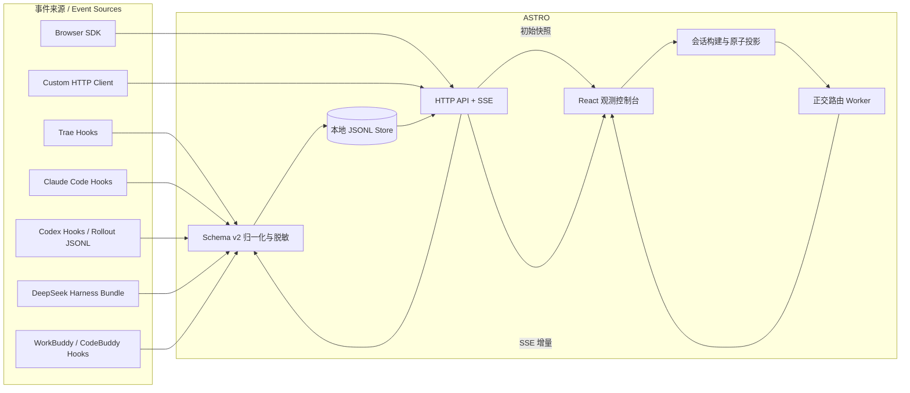
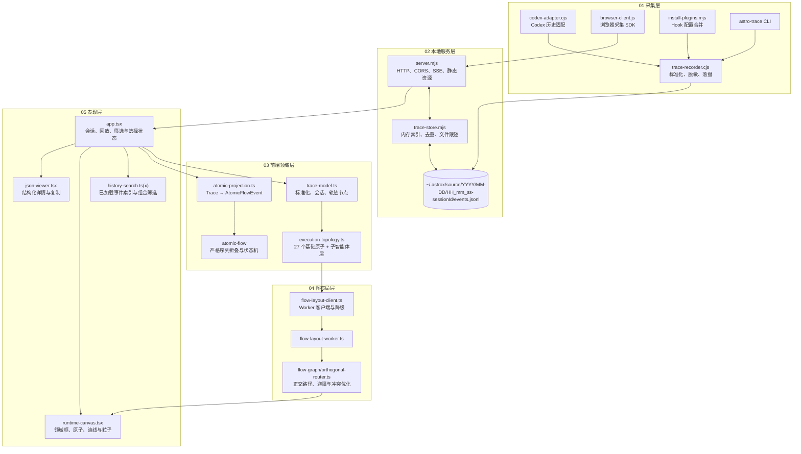
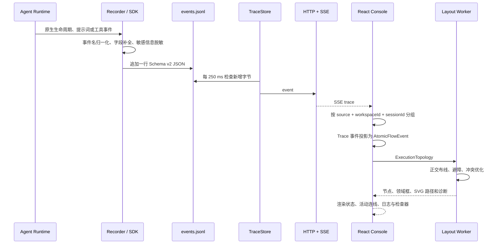

# ASTRO 架构说明

> 适用范围：当前仓库中的采集插件、本地服务、事件模型、原子投影、拓扑布局与 React 控制台

## 1. 系统定位

ASTRO 是 **Agent State Trace & Runtime Observations** 的缩写，即“智能体状态追踪与
运行时观测”。

ASTRO 是面向编码智能体的本地优先运行时可观测平台。它把 Trae、Claude Code、Codex、DeepSeek Harness、WorkBuddy / CodeBuddy Code、浏览器扩展和自定义客户端产生的异构事件统一为版本化 Trace 事件，在本地 JSONL 文件中持久化，并提供实时观察、搜索、检查和历史回放。

系统有三条明确边界：

- 它观察智能体运行，不负责调用模型、调度工具或改变智能体决策。
- 原始事件是事实来源；“原子”是为了可视化而生成的语义投影。
- 数据默认仅保存在运行本机，不依赖远程数据库或外部 CDN。

## 2. 系统上下文



## 3. 容器与组件架构



## 4. 端到端数据流



## 5. 统一事件协议

持久化协议版本为 `schemaVersion: 2`。前端仍兼容较早事件，并在读取时补齐标准字段。

| 字段 | 类型 | 说明 |
| --- | --- | --- |
| `schemaVersion` | number | 当前采集器写入 `2` |
| `id` | string | 全局事件 ID；Codex 历史导入使用确定性哈希 |
| `capturedAt` | ISO 8601 string | 事件采集时间 |
| `source` | string | 规范化来源，如 `trae`、`claude`、`codex`、`workbuddy`、`browser` |
| `sourceVersion` | string \| null | 来源客户端版本 |
| `workspaceId` | string | 工作区标识；缺省时由绝对 `cwd` 的 SHA-256 前 12 位生成 |
| `sessionId` | string | 来源侧原生会话 ID |
| `turnId` | string \| null | 轮次相关 ID |
| `parentId` | string \| null | 子智能体或父执行关系 |
| `eventName` | string | 规范化事件名 |
| `nativeEventName` | string | 来源侧原始事件名 |
| `toolUseId` | string \| null | 工具调用关联 ID |
| `toolName` | string \| null | 工具或能力名称 |
| `cwd` | string \| null | 运行目录 |
| `status` | string \| null | 来源状态或推断失败状态 |
| `sequence` | number \| null | 来源可选序号 |
| `payload` | object | 脱敏后的原始业务载荷 |
| `locator` | string | `trace://source/session/event` 原子定位符 |

### 5.1 规范事件类型

系统识别 17 类标准事件：

`SessionStart`、`SessionEnd`、`Interrupt`、`UserPromptSubmit`、
`AgentMessage`、`Reasoning`、`PreToolUse`、`PostToolUse`、
`PostToolUseFailure`、`PermissionRequest`、`Elicitation`、
`ElicitationResult`、`Notification`、`SubagentStart`、`SubagentStop`、
`Stop`、`StopFailure`。事件日志把 `Notification` 标记为 `user.question`
（`AskUserQuestion`），但不会改写持久化事件。

未识别事件不会被丢弃，前端会按 `Unknown` 类型保留和展示。

`Stop` 表示一轮回答完成，不代表会话采集结束。相同 `sessionId` 的后续
`UserPromptSubmit`、消息、工具和 `Stop` 会继续追加到原会话文件。

### 5.2 会话隔离

会话键不是单独的 `sessionId`，而是：

```text
source::workspaceId::sessionId
```

这样可以避免不同智能体平台使用相同原生会话 ID 时发生冲突。

## 6. 采集与适配

### 6.1 Hook 采集

`scripts/install-plugins.mjs` 以增量方式合并配置，不覆盖已有 Hook：

- Trae：写入目标项目的 `.trae/hooks.json`。
- Claude Code：写入目标项目的 `.claude/settings.local.json`。
- Codex：写入 `$CODEX_HOME/hooks.json`，默认 `~/.codex/hooks.json`。
- WorkBuddy：写入目标项目的 `.codebuddy/settings.json`，或用户级
  `$CODEBUDDY_HOME/settings.json`。

Hook 通过标准输入把原生事件传给 `plugin/trace-recorder.cjs`。采集器即使遇到解析或
写入错误也会正常退出，避免可观测系统中断智能体主执行路径，同时把“事件未写入”
或“控制台未启动”的诊断写到 stderr，防止静默丢失。Claude Code、Trae 与 WorkBuddy 会收到
`{"continue":true}`；Codex 使用 quiet 模式保持 stdout 为空，因为部分 Codex Hook
事件不接受 `continue` 字段。所有客户端统一使用用户级 `~/.astrox` 数据与运行时根目录。

标准化事件为 `SessionStart` 或 `UserPromptSubmit` 时，采集器还会检查
`<data-root>/dashboard-<port>.pid`。如果控制台未运行且
`ASTRO_AUTO_OPEN` 未关闭，采集器以脱离 Hook 的后台进程启动同包内
`server/server.mjs`。新启动的服务会打开已选中来源和会话的深链；兼容服务已运行
时复用现有进程，只报告当前会话 URL，不重复打开标签页。服务完成端口回退并开始
监听后，才打开实际 URL。启动或打开失败都被隔离在观测路径内，不改变 Hook 的放行结果。

### 6.2 Codex 历史导入

`plugin/codex-adapter.cjs` 支持导入 `sessions` 和 `archived_sessions` 中的 rollout JSONL。事件 ID 由文件路径、行号、时间、类型和调用 ID 共同哈希，因此重复导入不会产生副本。

### 6.3 DeepSeek Harness Bundle

`deepseek-plugin/` 是符合官方 `dsh.bundle` 规范的 Cordis 插件包。它订阅
`session/created`、`session/event` 和 `session/disposed`，把 Harness 原生事件映射为
ASTRO 的会话、Prompt、模型回复、工具和终止语义，同时将原始事件保留在 payload 中。
安装器通过 `dsh plugin --profile <name> add <package>` 修改指定 profile，不写入
`hooks.json`。

### 6.4 WorkBuddy / CodeBuddy Code 插件

`workbuddy-plugin/` 是包含 `.codebuddy-plugin/plugin.json` 的自包含原生插件。
Hook 命令使用 `${CODEBUDDY_PLUGIN_ROOT}`，并保留权限、Elicitation、通知和
`StopFailure` 事件。限流和等待用户输入会投影为等待态，而不是失败或推测终止。

### 6.5 Browser SDK 与自定义 HTTP

浏览器 SDK 以无依赖 ES Module 提供：

- `startSession`
- `submitPrompt`
- `startTool`
- `finishTool`
- `agentMessage`
- `stop`
- `search`

通用客户端可以直接向 `POST /api/events` 发送单个事件、事件数组，或 `{ "events": [...] }` 包装体。

## 7. 本地存储与实时服务

所有客户端的默认根目录均为 `ASTRO_HOME=~/.astrox`：

```text
~/.astrox/
  plugins/astro/
  claude/YYYY/MM-DD/HH_mm_ss-<sessionId>/events.jsonl
  codex/YYYY/MM-DD/HH_mm_ss-<sessionId>/events.jsonl
  deepseek/YYYY/MM-DD/HH_mm_ss-<sessionId>/events.jsonl
  trae/YYYY/MM-DD/HH_mm_ss-<sessionId>/events.jsonl
  workbuddy/YYYY/MM-DD/HH_mm_ss-<sessionId>/events.jsonl
  browser/YYYY/MM-DD/HH_mm_ss-<sessionId>/events.jsonl
  <custom-source>/YYYY/MM-DD/HH_mm_ss-<sessionId>/events.jsonl
```

旧的 `AOT_HOME` 与 `AGENT_TRACE_*` 变量仅作为升级兼容入口保留。新部署使用
`ASTRO_HOME`、`ASTRO_TRACE_DIR` 和 `ASTRO_PROJECT_DIR`。

### 7.1 TraceStore

`TraceRepository` 默认每 `500 ms` 递归发现新的 `events.jsonl`，并为每个文件创建
一个 `TraceStore`。每个 Store 默认每 `250 ms` 检查追加字节，同时维护：

- 本地 JSONL 追加日志；
- 进程内事件数组；
- 基于事件 ID 的追加去重；
- 基于文件字节偏移的增量读取；
- 文件截断后的全量重载；
- 对损坏行的隔离，单行错误不会隐藏后续有效事件。

这个设计允许 Hook 直接写文件，同时由服务端持续跟随，不要求 Hook 进程与服务端共享内存。发现新会话文件或文件截断时，Repository 会广播完整 `reset`。

### 7.2 HTTP API

| 方法 | 路径 | 用途 |
| --- | --- | --- |
| `GET` | `/api/health` | 健康状态、事件数和 Trace 文件路径 |
| `GET` | `/api/events` | 全量事件；支持 `source`、`session` 过滤 |
| `GET` | `/api/events/:eventId` | 按 ID 精确读取 |
| `POST` | `/api/events` | 写入单个或批量事件 |
| `DELETE` | `/api/events` | 清空服务端本地事件 |
| `GET` | `/api/search?q=` | 跨嵌套字段搜索；支持来源和会话过滤 |
| `GET` | `/api/stream` | `ready`、`trace`、`reset` SSE 事件流 |

只有写入端点开放浏览器 CORS 预检；读取、搜索和 SSE 默认同源。请求体默认限制为 `5 MiB`。

## 8. 前端领域模型

前端维护五种层次不同的数据：

1. `TraceEvent`：来源事件的标准化事实。
2. `TraceSession`：按来源、工作区和原生会话 ID 组织的长期会话容器。
3. `TracePromptRun`：一条 `UserPromptSubmit` 及同一会话中下一条 Prompt 之前的
   全部事件。
4. `TraceNode`：用于轨迹视图的步骤；成对的 `PreToolUse` / `PostToolUse` 合并为
   一个工具步骤。
5. `AtomicFlowEvent`：一个 Trace 事件可投影为多个具有阶段和实例 ID 的原子事件。

例如一个成功工具调用会形成：

```text
PreToolUse
  → model.invoke:end
  → action.gate:end
  → tool.call:start
  → tool.resolve:end
  → tool.execute:start

PostToolUse
  → tool.execute:end
  → tool.call:end
  → tool.result:end
  → observation:end
  → stage.checkpoint:end
  → memory.capture:end
```

拓扑中的工具输出按
`tool.execute → tool.result → observation` 传递。选择 `PostToolUse` 或
`PostToolUseFailure` 事件时，会定位到独立的 `tool.result` 原子。

`foldAtomicEvents` 要求序号严格递增且同一次折叠只能包含一个 `runId`，并把阶段折叠为 `scheduled`、`running`、`completed`、`failed` 或 `skipped`。

会话状态依据最新提示词、`Stop`、失败和终止事件计算为 `active`、`complete`、
`failed` 或 `terminated`。active 会话的显示时长使用当前时间每秒更新。
`appTimings.activeRunTimeoutMs` 默认把仍在增加的显示时长封顶为 24 小时；到达阈值后，
有效 UI 状态变为 `terminated`，停止实时动画，并在没有其他计时项时移除刷新定时器。
这是读取时投影，不改写来源事件或持久化状态；已结束时长保持固定且不会被截断。

`buildSessionPromptRuns` 按排序后的每条 Prompt 对会话进行无损切分。首个区间标记为
`initial`，后续区间标记为 `follow-up`；每个区间独立计算标题、状态、时长、工具数和
事件列表。最后一个区间在必要时继承会话终态，历史区间保持为不可变诊断单元。没有
Prompt 的会话仍以完整会话作为兼容回退。

### 8.1 运行状态派生链路

超时逻辑刻意放在采集和持久化之后：

```text
不可变 TraceEvent[]
  -> buildSessions()
  -> buildSessionPromptRuns()
  -> getRunHistoryDisplayState() / getSessionDisplayState()
  -> 有效 { status, duration }
  -> Run History + 拓扑 + 轨迹 + 日志
```

`src/app.tsx` 为整个页面维护一个 `now`。只有至少一个父行或 Prompt 仍可继续计时
时，页面才启动 `sessionDurationRefreshMs` 间隔。纯展示函数接收已记录运行、
`now` 和 `activeRunTimeoutMs`，自身不读取系统时钟。这样既能在测试中精确验证阈值，
也避免每一行各自创建定时器。

当前选中 Prompt 与 Run History 消费同一份有效状态。`isPromptExecuting` 只对有效
`active` 返回 true，因此到达阈值后 `executingLive` 会关闭，运行中日志标记消失，
拓扑不再产生新的转换动画。底层事件列表、原子投影和 JSONL 仍可用于检查与回放。

### 8.2 父行与 Prompt 计时规则

| 界面层级 | 继续计时条件 | 冻结条件 | 超时结果 |
| --- | --- | --- | --- |
| Session 父行 | 最新 Prompt 为 `active` 或 `waiting` | 最新 Prompt 为 `complete`、`failed` 或 `terminated` | 封顶父会话时长并派生 `terminated` |
| Prompt 子行 | `active` 或 `waiting` | `complete`、`failed` 或 `terminated` | 封顶 Prompt 时长并派生 `terminated` |
| 当前选中执行 | 有效选中状态为 `active` | 其他全部有效状态 | 停止 Live 动画和运行标记 |

在 `阈值 - 1 ms` 时，继续计时状态保持不变；恰好到达阈值时，显示时长等于阈值，
有效状态变为 `terminated`；超过阈值后仍保持封顶。已有终态不经过这项计算，因此历史
complete 记录即使超过当前实时阈值，也保留其原始时长。

### 8.3 终态判定：失败与终止

Run History 行的状态必须与运行的真实结局一致：一旦出现失败或消息流终止，行状态
必须落入终态（`failed` / `terminated` / `complete`），不得停留在 `active` / `waiting`。

事件驱动的终态规则（`getTraceRunStatus`）：

| 事件 | 状态 | 说明 |
| --- | --- | --- |
| `Stop` | `complete` | 正常收尾 |
| `StopFailure` | `failed` | stop 级失败，运行结束；其后到达的进度噪声（如 `SubagentStop`）不会把状态复活为 `active` |
| `SessionEnd` / `Interrupt` | `terminated` | 会话结束或用户打断 |
| 事件 `status` 为 failed、`PermissionDenied`、`PostToolUseFailure`、`tool_response.error`、非零 `exitCode` | `failed` | 运行中途失败；若随后仍有执行进度事件，则视为可恢复，状态回到 `active` |

补充规则：

- Prompt 事件窗口在首个 stop 级事件（`Stop`、`StopFailure`、`SessionEnd`、
  `Interrupt`）处截断，stop 级事件之后的噪声不参与该次运行的状态派生。
- 消息流静默（未收到任何终态事件）时，`active` 与 `waiting` 都按
  `activeRunTimeoutMs` 封顶并派生 `terminated`，运行时长停止推进。
- 父行状态取最新 Prompt 的有效状态（`getRunHistoryDisplayStatus`），因此最新
  Prompt 落入终态后父行同步终止。

### 8.4 会话与运行的数据结构

`TraceSession` 与 `TracePromptRun` 是前端对来源事件做无损投影后得到的诊断单元，二者都不改写来源事件，状态与时长均为读取时派生。

`TraceSession`（按 `source::workspaceId::sessionId` 聚合）：

| 字段 | 类型 | 说明 |
| --- | --- | --- |
| `key` | `string` | 组合键 `source::workspaceId::sessionId`，避免跨平台冲突 |
| `id` | `string` | 原生会话 ID |
| `source` | `string` | 平台来源标识 |
| `workspaceId` | `string` | 工作区标识 |
| `cwd` | `string \| null` | 采集时的工作目录 |
| `events` | `TraceEvent[]` | 该会话内的全部事件 |
| `title` | `string` | 派生命名（首条 Prompt 或会话标识） |
| `start` / `end` | `number` | 事件时间边界（epoch 毫秒） |
| `duration` | `number` | `end - start`（实时态下 `end` 取当前时钟） |
| `status` | `TraceRunStatus` | `active` / `complete` / `failed` / `terminated` / `waiting` |
| `toolCount` | `number` | 工具调用事件数 |

`TracePromptRun`（在 `TraceSession` 内按每条 `UserPromptSubmit` 切分）：

| 字段 | 类型 | 说明 |
| --- | --- | --- |
| `key` | `string` | 组合键，含会话与序号 |
| `sessionKey` / `sessionId` | `string` | 所属会话键 / 原生会话 ID |
| `source` / `workspaceId` / `cwd` | 同源 | 继承所属会话 |
| `prompt` | `TraceEvent` | 该区间起始的 `UserPromptSubmit` 事件 |
| `events` | `TraceEvent[]` | 该 Prompt 至下一条 Prompt 之前的全部事件（首个区间继承会话终态） |
| `index` | `number` | 区间序号，从 0 开始 |
| `role` | `"initial" \| "follow-up"` | 首个区间为 `initial`，其余为 `follow-up` |
| `title` / `start` / `end` / `duration` / `status` / `toolCount` | 同 `TraceSession` | 按当前区间独立计算 |

派生链路：`buildSessions()` 把事件聚合成 `TraceSession`，`buildSessionPromptRuns()` 在每个 Prompt 处无损切分为 `TracePromptRun`；首个区间标记为 `initial`，后续为 `follow-up`，历史区间作为不可变诊断单元。没有 Prompt 的会话仍以完整会话作为兼容回退。

运行数据在磁盘上的布局（由 `storage-paths.cjs` 解析）：

- 会话事件文件：`<ASTRO_HOME>/<source>/YYYY/MM-DD/HH_mm_ss-<sessionId>/events.jsonl`，按来源、日期和时间戳目录组织，单文件 JSONL 追加写入。
- 仪表盘守护进程状态：`<ASTRO_HOME>/dashboard-<port>.pid`（含 `pid`、`url`、`server` 的 JSON），由服务端自身写入，任何启动器都能据此发现运行中的实例。
- 仪表盘运行日志：`<ASTRO_HOME>/dashboard.log`，由 `astrox start` 触发写入。

`ASTRO_HOME` 默认 `~/.astrox`；`ASTRO_TRACE_DIR` / `AGENT_TRACE_DIR` / `TRAE_TRACE_DIR` 可整体重定向 trace 根目录，`ASTRO_PROJECT_DIR` 等控制项目子路径。

## 9. 执行拓扑

基础拓扑包含 6 个领域、27 个原子和 28 条定义连线。平台切换只改变平台标识与事件映射上下文，原子语义保持稳定。

| 领域 | 原子数 | 原子键 |
| --- | ---: | --- |
| Session Control | 5 | `prompt.input`、`session.resume`、`stage.start`、`stage.checkpoint`、`stage.finish` |
| Agent Execute | 11 | `run`、`agent.select`、`model.invoke`、`loop.turn`、`action.gate`、`observation`、`tool.call`、`usage.record`、`handoff`、`user.question`、`reply.final` |
| Memory System | 2 | `memory.recall`、`memory.capture` |
| Capability Runtime | 4 | `tool.resolve`、`tool.execute`、`tool.result`、`agent.result` |
| Quality Gates | 3 | `gate.quality`、`artifact.final`、`output.commit` |
| Telemetry | 2 | `telemetry.append`、`trajectory.project` |

全部 28 条基础连线在会话早期、完整态和回放态中都保持可见，事件证据只更新原子和
连线状态，不增删基础结构。检测到 `SubagentStart` 后，系统会为每个子智能体动态
增加一个 `Subagent Execute` 领域，包含 8 个节点：

`Subagent Spawn → Run → Agent Select → Model Invoke → Action Gate → Tool Call → Observation → Agent Result`

动态子智能体节点中没有直接事件证据的步骤会标记为 `INFERRED`，用于明确区分事实和结构化推断。

## 10. 正交路由

拓扑路由在 Web Worker 中执行，主线程只负责状态和渲染。路由器的当前关键参数包括：

| 参数 | 当前值 | 作用 |
| --- | ---: | --- |
| `clearance` | 12 | 节点与障碍物安全距离 |
| `bendPenalty` | 32 | 减少不必要折点 |
| `crossingPenalty` | 960 | 强烈抑制连线交叉 |
| `parallelGap` | 16 | 平行线间距 |
| `portStubLength` | 18 | 端口出入短线长度 |
| `maxCoordinatesPerAxis` | 72 | 可见性图坐标上限 |
| `maxOptimizationPasses` | 32 | 冲突重路由次数上限 |

路由流程：

1. 根据固定或偏好端口确定候选端点。
2. 把节点边界和领域标题区扩张为障碍物。
3. 构建水平/垂直可见性图。
4. 评估长度、折点、碰撞、重叠、邻近和端口偏差。
5. 对冲突边重新路由，直到质量不再提升或达到上限。
6. 输出正交点列、圆角 SVG 路径、长度、诊断和降级标记。

Worker 不可用时，`FlowLayoutClient` 会动态导入同一布局实现并在主线程执行，以保证功能可用。

## 11. 界面状态与回放

前端启动后直接连接 `/api/stream`。每次初连或重连时，服务先在同一有序连接上发送
完整 `reset`，再发送 `ready`，之后才发送单条 `trace` 增量。这样即使浏览器在
断线期间错过后续问答，重连快照也会补齐完整会话。客户端按事件 ID 合并增量，避免重复。

内置 Demo 只允许在 Vite development 或 test 环境、且真实事件数为 0 时使用。
production 构建空数据时保持真实空状态，不生成测试会话。

当前 Prompt 子运行是拓扑、轨迹、事件日志、检查器、回放与导出的统一输入。深链按
事件定位其所在 Prompt 区间；在最新会话的 Live 状态下，新 Prompt 会自动成为当前
区间，手动选择历史区间则退出 Live。

全局 History 搜索为浏览器已经加载的全部事件建立索引。它先组合时间、Agent、运行
状态和事件分类条件，再执行不区分大小写的子串或有序模糊评分，并自动分批渲染结果。
选择结果是一次协调状态变更：切换来源、Session、Prompt、精确事件和映射原子，退出
回放，打开 History 与 Events，并向拓扑和日志发送独立定位请求。该客户端索引与
服务端 `/api/search` 刻意保持独立。

回放模式不会修改数据，而是把当前 Prompt 子运行截断到
`promptRun.events.slice(0, cursor + 1)` 后重新构建轨迹、原子状态与拓扑。支持
`0.5x`、`1x`、`2x`、`4x` 速度。

选择状态有三种含义：

- `undefined`：跟随当前事件自动映射原子。
- 具体原子 ID：保持用户手动选择。
- `null`：显式取消选择。

活动原子变化时，系统在拓扑边中进行有向优先、无向兜底的路径搜索，并在约 `2.2 s` 内显示流动粒子。

可持久化的用户偏好全部使用 `ASTROX_` 前缀：`ASTROX_THEME`、
`ASTROX_PLATFORM`、`ASTROX_HISTORY_OPEN` 和 `ASTROX_CONSOLE_OPEN`。
旧 `astro-theme`、`astro-platform` 仅在迁移时读取，并在新键写入后删除。
localStorage 不可用时回退默认值，Trace 数据和当前页面操作不受影响。

业务默认值、计时参数、Storage Key、主题选项、轨迹标签和共享样式常量集中在
`src/config/app-config.ts`；安全的 Storage 读写封装位于
`src/lib/local-storage.ts`。Vite 的开发代理从同一 `ASTRO_HOST/ASTRO_PORT`
环境读取目标，默认连接 `127.0.0.1:4318`。

## 12. 安全与隐私

### 已实现

- 默认仅绑定 `127.0.0.1`。
- 事件默认写入本地 `~/.astrox/<source>/YYYY/MM-DD/HH_mm_ss-<sessionId>/events.jsonl`。
- 按敏感键名递归脱敏，如 `authorization`、`cookie`、`password`、`secret`、`apiKey`、各类 token 和私钥。
- 对字符串中的 Bearer Token、`sk-` 密钥、常见键值秘密和 JWT 进行模式脱敏。
- 静态文件服务验证路径必须位于 `dist` 目录内。
- POST 请求体有大小限制。
- Hook 失败不会阻断智能体。

### 需要注意

- 脱敏是规则驱动的，不是完整的数据防泄漏系统；新型或业务自定义秘密可能未被识别。
- 如果把监听地址改为非回环地址，应在外层增加认证、TLS、访问控制和网络策略。
- `DELETE /api/events` 没有鉴权，安全前提是服务只在本机可信环境暴露。
- UI 导入的数据仅存在当前浏览器内存；清空或刷新行为与服务端事件需要分别理解。

## 13. 性能与容量边界

- JSONL 适合本地单机、追加写和可移植备份，但当前没有分片、压缩或归档策略。
- 服务端在内存中保存完整事件数组；`GET /api/events` 返回完整匹配集合。
- 搜索会遍历事件及其嵌套字段，没有倒排索引。
- UI 会加载全部事件后在内存中构建会话。
- Repository 每 `500 ms` 发现新文件，每个 TraceStore 每 `250 ms` 跟随文件追加。
- 路由器默认最多接受 500 个节点、1,000 条边；基础拓扑远低于该上限，子智能体层会线性增加节点。
- 布局结果按会话、平台、面板状态和图结构缓存，重复渲染不会重复计算同一布局。

如果目标是长时间、多工作区或团队级观测，需要进一步增加分页/流式历史读取、索引存储、归档、认证和保留策略。

## 14. 故障与降级行为

| 场景 | 当前行为 |
| --- | --- |
| 单行 JSONL 损坏 | 跳过该行，继续读取其他事件 |
| Trace 文件被截断 | 全量重读并广播 `reset` |
| 重复事件 ID | `TraceStore.append` 忽略重复项 |
| SSE 断开 | UI 标记 `offline`；服务声明 1 秒重连间隔，重连后先发送完整 `reset` 补齐事件 |
| Worker 创建失败 | 回退到主线程布局 |
| 路由无法达到最优 | 返回诊断与 `fallback` 标记，尽量继续渲染 |
| 无事件 | development/test 使用内置 Demo；production 保持真实空状态 |
| Hook 解析/落盘错误 | stderr 报告诊断，正常退出且不阻断 Agent；Codex quiet 模式保持 stdout 兼容 |
| localStorage 不可用或值非法 | 回退响应式默认值；不影响 Trace 读取和当前页操作 |
| 仍在计时的运行达到配置阈值 | 派生封顶的 `terminated` 展示；没有其他计时项时停止共享时钟，并保留持久化事件 |

## 15. 代码定位

| 责任 | 文件 |
| --- | --- |
| HTTP、SSE、静态站点 | `server/server.mjs` |
| JSONL 存储与文件跟随 | `server/trace-store.mjs` |
| 采集、归一化、脱敏 | `plugin/trace-recorder.cjs` |
| Codex 历史适配 | `plugin/codex-adapter.cjs` |
| Browser SDK | `plugin/browser-client.js` |
| CLI | `bin/astro.mjs` |
| Hook 安装 | `scripts/install-plugins.mjs` |
| 会话、轨迹、时长与有效状态模型 | `src/lib/trace-model.ts` |
| 运行历史状态与超时投影 | `src/lib/run-history-state.ts` |
| 已加载历史搜索索引与筛选 | `src/lib/history-search.ts` |
| History 搜索对话框 | `src/components/history-search.tsx` |
| Trace 到原子投影 | `src/lib/atomic-projection.ts` |
| 执行拓扑生成 | `src/lib/execution-topology.ts` |
| Worker 路由适配 | `src/lib/flow-layout-client.ts` |
| 正交路由器 | `src/vendor/flow-graph/orthogonal-router.ts` |
| 控制台状态与交互 | `src/app.tsx` |
| 拓扑画布 | `src/components/runtime-canvas.tsx` |
| UI 默认值、计时与 Storage Key | `src/config/app-config.ts` |
| 安全的偏好读写与旧键迁移 | `src/lib/local-storage.ts` |
| 开发 API 代理 | `vite.config.ts` |

## 16. 架构验证

当前仓库的自动化验证覆盖：

- 敏感信息脱敏和事件标准化；
- Hook 安装配置的增量合并；
- Codex 历史导入与确定性去重；
- 会话隔离、工具开始/结束配对和搜索；
- 子智能体动态执行层；
- Trace 到 AtomicFlowEvent 的严格序列投影；
- 原子实例状态折叠；
- 所有可见拓扑边的正交性；
- TraceStore 追加去重与精确查询；
- 所有 Hook 客户端在 `Stop` 后继续记录重复文本的后续问答；
- Prompt 子运行切分、首轮/后续分类和逐轮状态；
- SSE 初次连接、持续增量和断线重连后的完整快照；
- active 会话时长刷新、可配置的 24 小时封顶和超时终止；
- 阈值前、恰好阈值、超过阈值、waiting 以及终态时长保留等精确边界；
- `ASTROX_` 偏好键、旧键迁移和无效值回退；
- production 禁止 Demo，以及 Vite 代理环境解析。

当前测试套件共 182 项。

验证命令：

```bash
pnpm test
pnpm typecheck
pnpm build
```

协议字段、生产者约束和 SSE 顺序参见 [事件协议参考](event-protocol-zh.md)，部署、
权限、备份和连续问答验收参见 [运维与故障处理手册](operations-zh.md)。

## 17. 实施状态与运行时配置

全部设计的当前状态、代码证据、测试证据和边界统一维护在
[实现细节与规划状态](implementation-details-zh.md)。

插件级共享 `config.yaml` 与 `.env` 已接入采集器、CLI、服务、安装器、DeepSeek
适配器、Vite 代理和原生插件包。安装器在 `<ASTRO_HOME>/plugins/astro` 创建两个
文件，后续升级保留用户修改。
